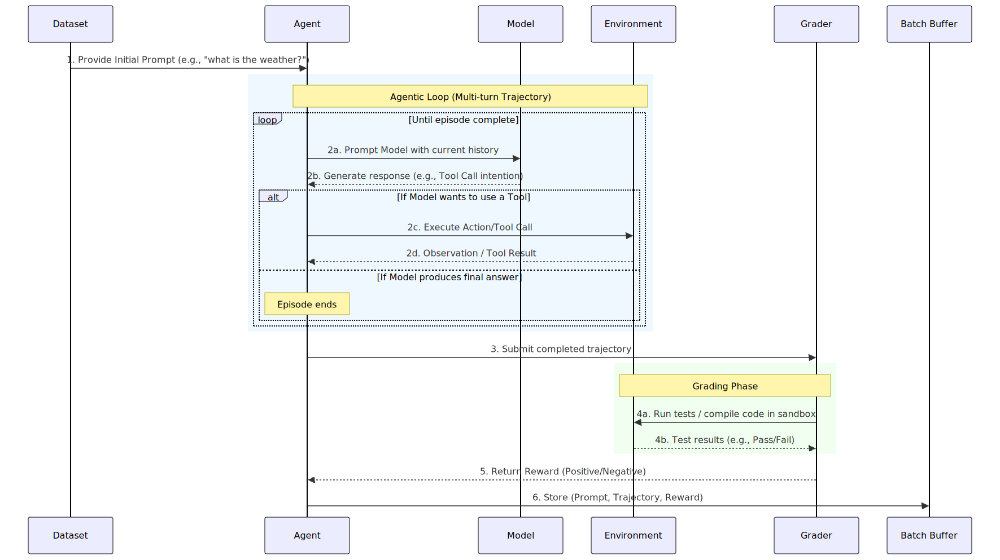
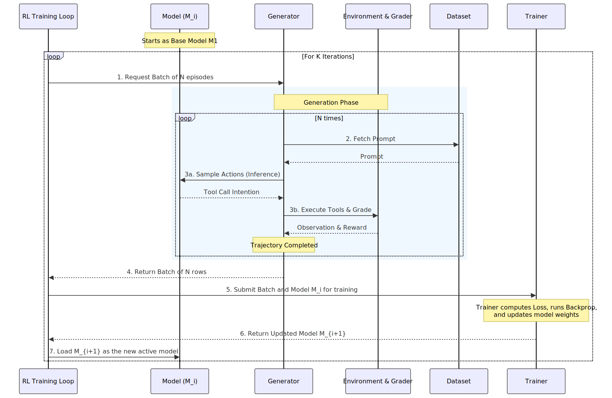
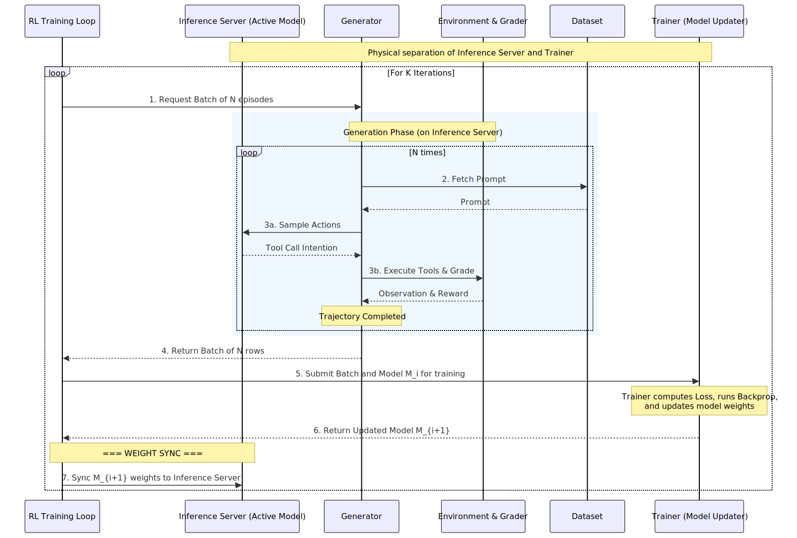

# Reinforcement Learning 101

This guide breaks down the core concepts of Reinforcement Learning (RL) for Large Language Models into two distinct phases to help understand how models are trained via agentic loops.

## 1. Life of an RL Data Row (Generation)
This phase focuses on the micro-level: how a single row of data is generated, evaluated, and stored. 

### Participants
- **Dataset**: Provides the starting prompt.
- **Agent**: The system/code that drives the episode, parses model outputs, and manages state.
- **Model**: The raw neural network (LLM) that generates tokens/responses.
- **Environment**: The external systems/tools (e.g., code interpreter).
- **Grader (Reward System)**: Computes the reward (could be a reward model, tests, or human).
- **Batch Buffer**: Stores the completed row.

### Interaction Flow


---

## 2. The RL Training Loop
This phase focuses on the macro-level: how batches are gathered and how the model evolves iteratively ($M_1 \rightarrow M_2 \rightarrow M_3$).

### View A: Logical Training Loop
A simplified view where the Model is an abstract single entity updated in-place.



### View B: Split Servers & Weight Sync
In real-world applications, the Trainer and Inference Server are separated physically. The active model generating data ($M_i$) runs on the Inference Server (GPUs/TPUs optimized for low latency), while the model being updated runs on the Trainer (optimized for high throughput).

This physical separation introduces a critical **Weight Sync** step.



---

## 3. Core Concepts of RL 101

To fully grok Reinforcement Learning in the context of LLMs, keep these foundational principles in mind:

1. **Agent vs. Model Distinction**: The *Model* is simply a statistical engine that predicts the next token. The *Agent* is the software wrapper that interprets those tokens (e.g., parsing a JSON tool call), executes actions in an environment, and appends the observations back into the Model's context window.
2. **Generation (Exploration)**: Unlike supervised fine-tuning where the "correct" answer is provided upfront, RL requires the model to *generate* its own responses. It essentially explores the solution space by running "episodes" or "trajectories" to discover what works.
3. **The Grader (Reward Signal)**: Because the dataset only provides the *prompt*, we need a way to grade the generated trajectory. This reward is the fundamental learning signal. It can be deterministic (e.g., did the code compile? did the tests pass in the environment?) or model-based (e.g., a separate Reward Model validating the final answer).
4. **The Iterative Loop**: RL is fundamentally cyclical. Data is generated using the *current* model ($M_1$), the model is trained on that data to maximize the likelihood of high-reward actions, producing a new model ($M_2$). That new model is then used to generate the *next* batch of data, ensuring the model continually learns from its own evolving capabilities.

---

## How-To: Mermaid Diagrams

This project uses `@mermaid-js/mermaid-cli` to render Mermaid diagrams locally.

### Quick Start
To generate all SVGs and PNGs from the Mermaid source files (`.mmd`), simply run:

```bash
make clean && make all
```

*(Setup includes local Node.js via `nvm`, global `mermaid-cli`, and a custom Chrome alias for Puppeteer stability).*
