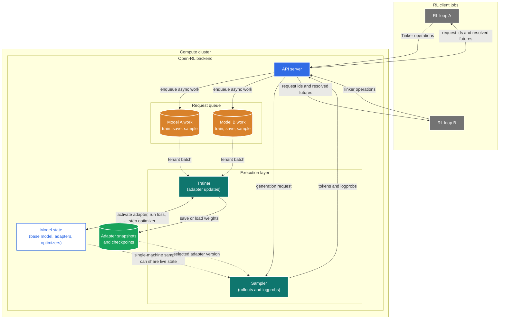

# Open-RL Architecture

Open-RL exposes a Tinker-compatible API for running reinforcement learning and
fine-tuning loops on self-hosted infrastructure. The core design is about
separating the user-owned RL loop from the backend concerns of request
coordination, adapter training, sampling, and checkpointing.

## System Model

## Blocks

### RL loop

The RL loop is user code written against the Tinker SDK. It owns the algorithm:
building prompts or batches, calling the environment or reward function,
computing loss inputs such as advantages, and deciding when to sample, train,
or save weights.

This layer should not depend on where the backend runs. The same client
workflow can point at a server on one machine during iteration or at a cluster
when more capacity is needed.

### API server

The API server accepts Tinker-compatible requests and turns long-running work
into asynchronous backend jobs. It returns request IDs immediately, resolves
them through `retrieve_future`, and uses long polling so clients can wait for
results without constantly retrying.

The API server is also the routing point for sampling. Depending on configuration,
generation requests can be handled by the trainer process or forwarded to a
dedicated sampler.

### Request queue

The request queue is the buffer between API admission and backend execution. It
tracks pending work and completed futures, and it groups work by `model_id` so
each adapter can be processed as a coherent tenant batch.

Conceptually, this is just a queue. A single-machine run can keep it in memory,
while a cluster run can back the same queue-and-futures abstraction with shared
state so separate processes can coordinate.

### Trainer

The trainer drains queued work, activates the requested adapter, and runs the
actual training operations: creating adapters, forward/backward passes,
optimizer steps, saves, and loads. It processes one tenant batch at a time so
adapter selection, gradients, and optimizer state stay consistent.

That serialization is important because the model is stateful. Switching the
active adapter in the middle of a backward pass or optimizer step would mix
state across training clients.

### Model state

Model state contains the shared base model, one LoRA adapter per training
client, and optimizer state scoped to each adapter. The base model provides the
fixed foundation, while adapters are the small trainable policy state that
changes during fine-tuning or RL.

Optimizer state is kept per adapter for the same reason the adapters are
isolated: momentum and other optimizer statistics are part of a client's
training state and must not leak across tenants.

### Adapter snapshots and checkpoints

Snapshots persist adapter weights so another component can load an exact policy
version. They are used for sampler handoff, explicit saves, restore flows, and
basic durability between operations.

On one machine, snapshots live under `OPEN_RL_TMP_DIR`. In a cluster, the same
concept maps to storage shared by the trainer and sampler.

### Sampler

The sampler produces rollouts and token logprobs for the RL loop. On one
machine this can run through the same model state as training; in a cluster it
can be a separate inference service that loads adapter snapshots.

Keeping sampling as a separate concept lets Open-RL use the same API contract
for single-machine iteration and cluster-backed inference. The client only sees
sample results, not the backend routing choice.

## Request Lifecycle

1. The client submits a Tinker operation to the API server.
2. The API server records a pending future and enqueues the operation.
3. The trainer drains tenant-specific work and updates model state.
4. Save operations write adapter snapshots for later sampling or restore.
5. Sampling requests produce tokens and logprobs from the selected adapter
   version.
6. The API server resolves the future, and the client retrieves the result.

## Deployment Mapping

| Concept | Single-machine run | Cluster run |
| --- | --- | --- |
| API server | Gateway process | Gateway service |
| Request queue | In-memory queue | Shared queue backing |
| Trainer | Background worker loop in the server process | Separate trainer worker |
| Sampler | Training process or optional inference process | Dedicated inference worker |
| Adapter snapshots and checkpoints | Local `OPEN_RL_TMP_DIR` | Shared filesystem mounted by workers |
