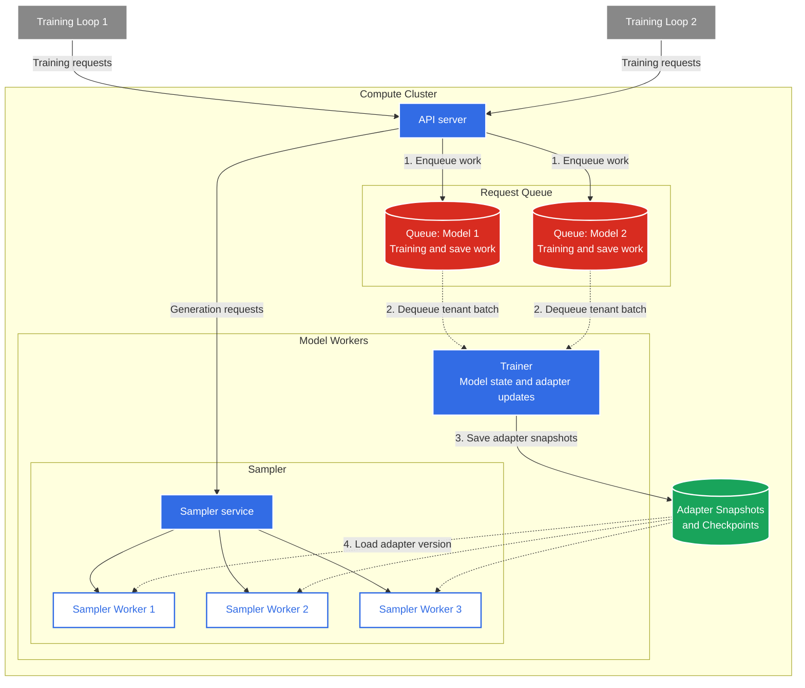

# Open-RL

Open-RL implements post-training APIs to fine-tune language models on
self-hosted infrastructure. These APIs cover common post-training techniques
such as supervised fine-tuning, reinforcement learning, and related workflows.

Conceptually, Open-RL decouples the researcher-facing training loop from the
infrastructure that runs it. Researchers own datasets, environments, rewards,
losses, and optimization logic; Open-RL owns the serving, scheduling, sampling,
and storage needed to run that loop. This separation lets training methods and
backend capacity evolve independently.

## System Architecture

Here is an architecture diagram:

## Components

### Training loop

The training loop is the user-owned part of the system. It builds prompts or
batches, calls environments or reward functions, computes loss inputs such as
advantages, and decides when to sample, train, or save a policy version.

This code should not have to know where the backend runs. The same workflow can
target a server on one machine during iteration or a cluster when more capacity
is needed.

### API server

The API server is the boundary between training code and model execution. It
accepts training requests, turns long-running operations into asynchronous
jobs, returns request IDs immediately, and resolves results through
`retrieve_future` with long polling.

The API server is also the routing point for sampling. Depending on configuration,
generation requests can be handled by the trainer process or forwarded to a
dedicated sampler.

### Request queue

The request queue buffers work between API admission and backend execution. It
tracks pending work and completed futures, and groups work by `model_id` so each
adapter can be processed as a coherent tenant batch.

At this level of the design, it is just a queue. A single-machine run can keep
it in memory, while a cluster run can back the same queue-and-futures
abstraction with shared state so separate processes can coordinate.

### Trainer

The trainer drains queued work, activates the requested adapter, and runs the
actual training operations: creating adapters, forward/backward passes,
optimizer steps, saves, and loads. It processes one tenant batch at a time so
adapter selection, gradients, and optimizer state stay consistent.

That serialization is important because the model is stateful. Switching the
active adapter in the middle of a backward pass or optimizer step would mix
state across training clients.

### Model state

Model state contains the shared base model, one LoRA adapter per training
client, and optimizer state scoped to each adapter. The base model provides the
fixed foundation, while adapters are the small trainable policy state that
changes during fine-tuning or RL.

Optimizer state is kept per adapter for the same reason the adapters are
isolated: momentum and other optimizer statistics are part of a client's
training state and must not leak across tenants.

### Adapter snapshots and checkpoints

Snapshots persist adapter weights so another component can load an exact policy
version. They are the handoff format between trainer and sampler, and they also
support explicit saves, restore flows, and basic durability between operations.

On one machine, a snapshot can just be a directory on local disk. In a cluster,
it should live on a filesystem visible to both the trainer and sampler.

### Sampler

The sampler produces rollouts and token logprobs for the training loop. On one
machine this can run through the same model state as training; in a cluster it
can be a separate inference service that loads adapter snapshots.

Keeping sampling as a separate concept lets Open-RL use the same API contract
for single-machine iteration and cluster-backed inference. The client only sees
sample results, not the backend routing choice.

## Request Lifecycle

1. The client submits a training request to the API server.
2. The API server records a pending future and enqueues the operation.
3. The trainer drains tenant-specific work and updates model state.
4. Save operations write adapter snapshots for later sampling or restore.
5. Sampling requests produce tokens and logprobs from the selected adapter
   version.
6. The API server resolves the future, and the client retrieves the result.

## Deployment Mapping

| Concept | Single-machine run | Cluster run |
| --- | --- | --- |
| API server | Server process | API service |
| Request queue | In-memory queue | Shared queue backing |
| Trainer | Background worker loop in the server process | Separate trainer worker |
| Sampler | Trainer process or optional sampler process | Dedicated sampler workers |
| Adapter snapshots and checkpoints | Local filesystem | Network shared filesystem |
