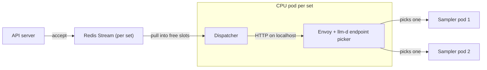

# Durable routed sampling: one Redis Stream and one dispatcher per sampler set

OpenRL keeps every accepted sampling request until one final result is saved,
across restarts of the API server, the dispatcher, the router and the samplers.
Each sampler set has one Redis Stream and one CPU pod. The pod's dispatcher pulls
stored work and sends it over HTTP through the llm-d router, which picks the GPU
sampler.

This covers LoRA sampling with fixed weights, behind `openrl.sampler_router=llmd`.
Tenant fairness and full fine-tuning are not in this version.

## Why

**The queue loses a request when its sampler dies.** A sampler takes a request off
a Redis list with `BLPOP`/`LPOP` before it generates, and saves the result as a
separate step. If the sampler stops in between, the request is gone and the client
polls forever.

**Pushing from the API server through a router loses the same request.** The router
can pick the replica that caches the prompt, but a task in the API process and a
receipt in Redis do not survive an API restart. The receipt can only report that
the work was interrupted.

**So the dispatcher pulls stored work and pushes it through the router.**

| Option | Gains | Loses |
| - | - | - |
| Samplers pull from a shared queue | Each sampler takes work when it has room | The first sampler to claim a request may not hold its prompt in cache; a claimed request dies with the sampler |
| The API pushes through llm-d | The router picks the replica by cache and load | Unfinished work does not survive an API restart |
| A dispatcher pulls stored work, then pushes through llm-d | Accepted work is recoverable, and the router picks the replica | OpenRL runs the dispatcher, bounds work in flight and owns retries |

## Request flow

1. The API validates the request, fixes its weights and appends it to the set's
   stream. It returns the request ID only after the write succeeds.
2. The dispatcher reads only as many entries as it has free slots. Redis keeps
   each one pending until it is acknowledged.
3. The dispatcher reserves an attempt and sends the request through Envoy on
   localhost. The picker chooses a ready sampler by queue depth, KV cache use and
   cached prefix.
4. The sampler returns the full result on the same HTTP call. The dispatcher saves
   it, acknowledges the entry and releases the capacity in one Redis script.
5. The client polls `retrieve_future` as before, and gets the saved result.

## Sets and ownership

| Thing | What it owns |
| - | - |
| Sampler set | One runtime, one stream, one consumer group, one active dispatcher. Each replica is its own GPU pod labelled `openrl.io/sampler-set=<set>`. |
| Request | One ID (`sampled:<set>:<uuid>`), immutable input, and at most one final result. |
| Attempt | One execution of a request, with its own attempt ID and engine request ID (`<request>#<n>`). |

Every key of a set shares the hash tag `{set}`, so the scripts that touch the
stream, the request state, the result and the counter run on one Redis node even
when Redis is sharded.

## Request contract

The stored input holds the prompt tokens, sampling parameters, fixed weights,
acceptance time and deadline. Execution state (attempt count, current attempt,
retry time) is kept apart and only the lease holder changes it.

**Weights are fixed at acceptance.** A `sampler_weights` reference names a frozen
snapshot (`save_weights_for_sampler` copies the adapter before it returns), and the
stored input carries that snapshot's path. A training job's live adapter is refused:
a retry must never pick up newer weights. A job that has not trained yet samples
its base model.

The client sees pending work or one final outcome: success, failure, cancellation
or deadline expiry. Reading a result does not consume it. An unknown or expired ID
reads as a failure, never as pending.

Recovery applies to an accepted ID. If the acceptance reply is lost, submitting
again creates a second request; deduplicating submissions is not in this version.

## Capacity

The API refuses, before acceptance, requests outside the limits: sample count,
prompt plus output beyond the model's window, and payload size. It also enforces
the set's unfinished-request limit in the same script that appends the request.

The dispatcher owns at most `OPEN_RL_DISPATCH_ACTIVE` requests, counting those
waiting to retry, and reads only enough entries to fill free slots. When no
sampler of the set is ready it waits without using attempts; deadlines still run.

## Redis Streams and recovery

1. **Accept.** One script checks that the set is open and under its unfinished
   limit, appends the entry and records its state.
2. **Claim.** `XREADGROUP` into free slots. The set's lease (a key renewed only by
   its holder) picks one active dispatcher, including during a rollout. Claims are
   renewed with a script that checks the lease and the entry's owner.
3. **Execute.** Reserve an attempt (lease checked, attempt counted even if the send
   never happens), then send with a timeout no longer than the request's deadline.
4. **Complete.** One script, checking the lease, the attempt ID and that the request
   is not already final: save the result, `XACK`, `XDEL`, release the capacity.
   A late attempt, an old lease holder or a second outcome changes nothing.
5. **Recover.** `XAUTOCLAIM` takes entries whose claims stopped being renewed. The
   request keeps its stream entry through every retry.

A lost HTTP response can mean generation finished but the result is unknown, so
recovery may generate again. Only one result is ever saved.

| Event | Action |
| - | - |
| Invalid input at submission | Refused before acceptance |
| Sampler answers 400 (the request can never succeed) | Final failure |
| Sampler answers 503/500, a timeout, or the connection drops | Retry with capped, jittered backoff; honour a bounded `Retry-After` on 429/503 |
| Sampler's response breaks the contract | Final failure |
| No sampler ready | Wait; no attempt is used |
| Deadline or attempt limit reached | Final failure, acknowledged |
| Request cancelled (set removed) | Final cancellation; its running attempt is cancelled |
| Redis unavailable or a write's outcome unknown | Stop; read the state back before any further attempt |

The sampler marks what may be retried with its status: 400 for requests it can
never serve, 503/500 for temporary failures, 504 when the attempt's deadline
passes. Leaving the call or passing the deadline cancels the engine request.

## Deployment

Each set gets one Deployment, `openrl-dispatch-<set>`, with the dispatcher, Envoy
and the endpoint picker in one pod. No sampler replica has a special role. The pod
needs no GPU and may run on a GPU node's spare CPU. The picker selects the set's
samplers by label; the dispatcher pod carries a different label, so it is never
mistaken for one. The dispatcher serves its metrics on port 9100.

A pod restart pauses dispatch; it does not touch the stream or accepted work. On a
planned stop the dispatcher stops claiming, lets active calls finish within its
grace period and leaves the rest pending for the next lease holder.

Removing a set closes it to new requests and finalizes its unfinished requests as
cancelled before the dispatcher is deleted.

**Redis holds the only copy of accepted work.** Run it with persistence (an
append-only file on a persistent disk) and keep its eviction policy from removing
these keys. An append-only file flushed every second can lose the last second of
accepted requests in a crash.

## Not in this version

- Fairness between tenants. New work is read in stream order, and active work is
  bounded per set.
- Full fine-tuning, whose weights change in place under one name.
- Deduplicating repeated submissions.
- Adjusting dispatch capacity automatically.

## Validation

Unit tests run against a real Redis and the real sampler HTTP app; only vLLM's
generate is replaced. They cover acceptance limits, one lease holder, guarded
completion, claim renewal and takeover, deadlines, bounded attempts, waiting for a
ready sampler, cancellation stopping a running attempt, and a request accepted by
one API process and finished after another starts.

On GKE, rounds of 512 requests through two sampler replicas:

| Disruption mid-round | Result |
| - | - |
| None | 512/512 |
| API server killed, no grace period | 512/512 |
| Dispatcher killed, no grace period | 512/512; the new holder reclaimed 246 claims |
| One sampler killed, no grace period | 512/512 |
| Dispatcher rolled | 512/512 |

Afterwards each set had no unfinished, pending or leftover entries, and removing a
set cancelled what remained and deleted its dispatcher.
