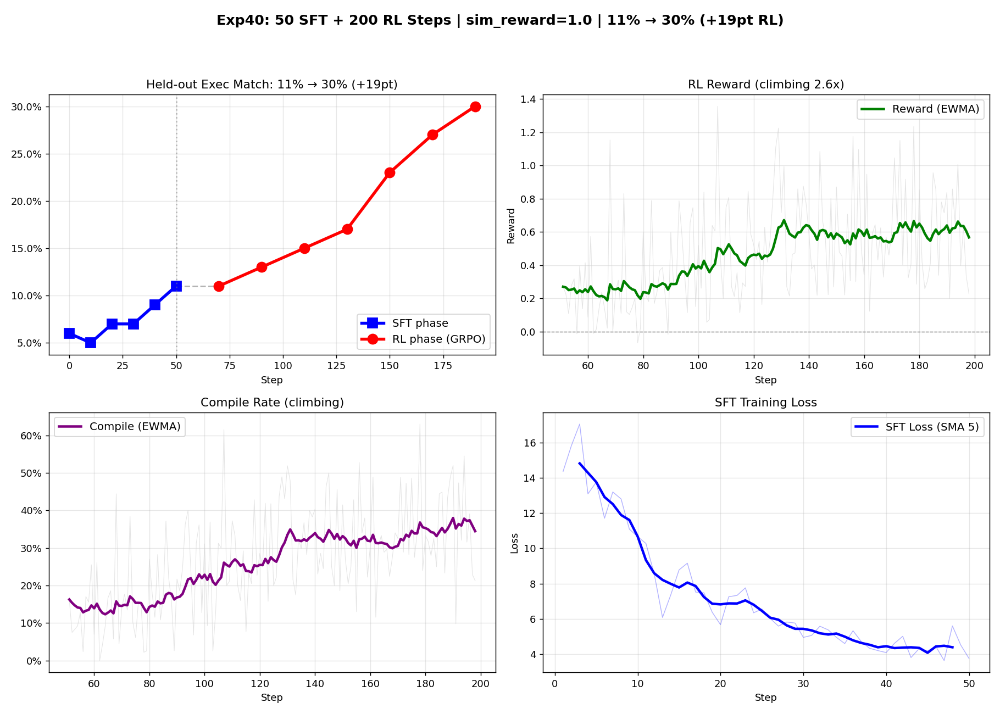

# Text-to-SQL Recipes

Direct `uv run` examples for the Text-to-SQL scripts live here so they do not have to be encoded in `Makefile` targets.

## Patch vLLM For Gemma4 LoRA

If you are using the separate `vllm` sampler path with Gemma4, check the local
`vllm` install before running training or eval:

```bash
cd server
uv run --extra vllm python scripts/patch_vllm_lora_dedup.py --check
```

If it reports `NEEDS_PATCH`, apply the fix:

```bash
cd server
uv run --extra vllm python scripts/patch_vllm_lora_dedup.py
```

This is the tiny local patch that fixes the duplicate-module LoRA registration
bug we hit with Gemma4 under `vllm`.

## Start The Server

Local single-process CPU run:

```bash
cd server
OPEN_RL_SINGLE_PROCESS=1 \
OPEN_RL_BASE_MODEL=google/gemma-4-e2b \
SAMPLER_BACKEND=torch \
VLLM_MODEL=google/gemma-4-e2b \
uv run --extra cpu uvicorn src.gateway:app --host 127.0.0.1 --port 9003
```

GPU trainer with a separate vLLM worker:

Terminal 1:

```bash
cd server
CUDA_VISIBLE_DEVICES=1 \
VLLM_MODEL=google/gemma-4-e2b \
uv run --extra gpu --extra vllm python -m src.vllm_sampler
```

Terminal 2:

```bash
cd server
CUDA_VISIBLE_DEVICES=0 \
OPEN_RL_SINGLE_PROCESS=1 \
OPEN_RL_BASE_MODEL=google/gemma-4-e2b \
SAMPLER_BACKEND=vllm \
VLLM_MODEL=google/gemma-4-e2b \
VLLM_URL=http://127.0.0.1:8001 \
uv run --extra gpu uvicorn src.gateway:app --host 127.0.0.1 --port 9003
```

## Run SFT

```bash
cd client
uv run --python 3.12 python -u texttosql_sft.py gemma4_e2b base_url=http://127.0.0.1:9003
```

## Run SFT + RL

```bash
cd client
uv run --python 3.12 python -u texttosql_sft_grpo.py gemma4_e2b base_url=http://127.0.0.1:9003 phase=full
```

## Run SFT Only

```bash
cd client
uv run --python 3.12 python -u texttosql_sft_grpo.py \
  gemma4_e2b \
  base_url=http://127.0.0.1:9003 \
  phase=sft_only \
  save_sft_state_name=texttosql-sft-gemma4
```

## Run RL Only

Fresh adapter:

```bash
cd client
uv run --python 3.12 python -u texttosql_sft_grpo.py \
  gemma4_e2b \
  base_url=http://127.0.0.1:9003 \
  phase=rl_only
```

Resume from a saved SFT checkpoint:

```bash
cd client
uv run --python 3.12 python -u texttosql_sft_grpo.py \
  gemma4_e2b \
  base_url=http://127.0.0.1:9003 \
  phase=rl_only \
  resume_state_path=texttosql-sft-gemma4
```

Checkpoint names are resolved by the server under `/tmp/open-rl/checkpoints/<name>` unless you pass an absolute path.

## Tuned RL Continuation

This preset keeps the lighter `importance_sampling` loss, a strong exact-match
reward, and a small compile reward so RL still favors executable SQL over
pure surface-form similarity.

```bash
cd client
uv run --python 3.12 python -u texttosql_sft_grpo.py \
  gemma4_e2b_rl_recipe \
  base_url=http://127.0.0.1:9003 \
  phase=rl_only \
  resume_state_path=/tmp/open-rl/checkpoints/texttosql-sft-gemma4
```

If you already have a known-good RL checkpoint and want to continue from that
instead of resuming directly from SFT, point `resume_state_path` at that saved
checkpoint path.

## GRPO Recipe (clean RL improvement)

The `gemma4_e2b_rl_recipe` preset combined with PPO + KL penalty (GRPO-style)
and a composite reward function gives clean, climbing RL curves on top of SFT.

```bash
cd client
uv run --python 3.12 python -u texttosql_sft_grpo.py \
  gemma4_e2b_rl_recipe \
  base_url=http://127.0.0.1:9003 \
  phase=full \
  sft_steps=50 sft_eval_every=10 sft_learning_rate=5e-5 \
  rl_steps=200 rl_eval_every=20 rl_learning_rate=5e-6 \
  rl_loss_fn=ppo rl_clip_range=0.2 rl_kl_coeff=0.1 \
  rl_samples_per_prompt=8 rl_prompts_per_step=8 \
  compile_reward=0.25 match_reward=2.0 compile_error_penalty=-0.25 \
  similarity_reward=1.0 \
  rl_train_limit=5000 train_limit=500 eval_limit=100
```

**Composite reward components** (all combined via `similarity_reward` weight):

- Schema linking — Jaccard of tables/columns referenced
- N-gram similarity — Jaccard of bigrams in normalized SQL
- SequenceMatcher similarity — string-level
- Partial execution credit — column count, row count, value overlap

**KL penalty** (`rl_kl_coeff`) adds a `(ratio - 1) - log(ratio)` term to the
PPO objective, preventing the policy from drifting too far from the reference
(post-SFT) model. This avoids catastrophic forgetting.

### Results

On `google/gemma-4-e2b` with 50 SFT + 200 RL steps:

- SFT: 5% → 11% execution match
- RL: 11% → **30%** execution match (+19pt)


