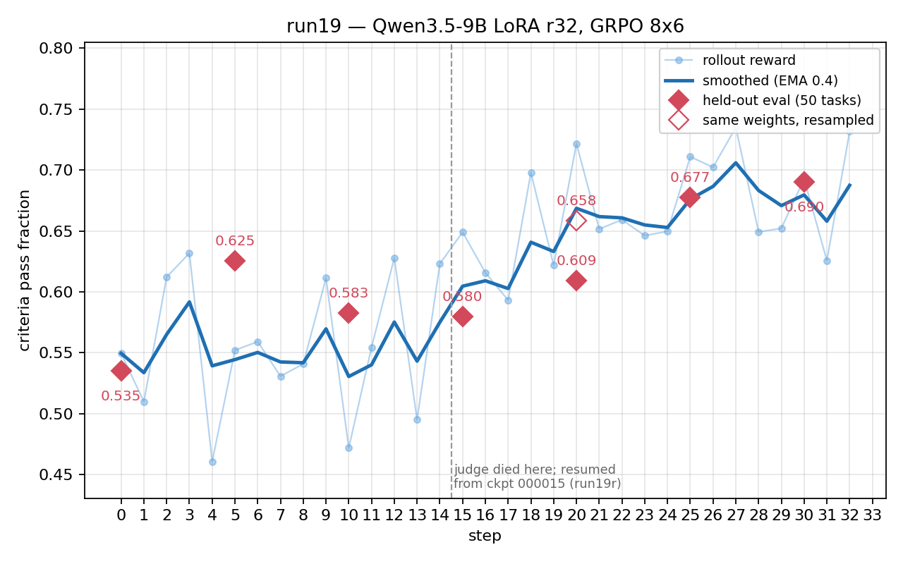

# run19 — Qwen3.5-9B on Harvey LAB

GRPO against the LAB rubric judge. Reward is the pure rubric pass fraction:
`process_reward_weight = 0.0`, so the shaping terms are logged but contribute
nothing. Held-out eval is 50 tasks, one rollout each, disjoint from the
training split via `train_split_seed=242`.

```
model_name=Qwen/Qwen3.5-9B  renderer_name=qwen3_5
learning_rate=2e-4  lora_rank=32           # constant LR, no schedule
batch_size=8  rollouts_per_example=6       # 48 rollouts/step
eval_every=5  task_set=random  judge_model=gpt-glm-5.2
stream_minibatches=True
max_tokens=32768  max_trajectory_tokens=163840  max_tool_result_tokens=16384
```



## Held-out eval

| step | criteria_pass_fraction | rubric (graded only) | graded | ctx overflow | no_output |
|-----:|-----:|-----:|-----:|-----:|-----:|
| 0 | 0.5351 | 0.6222 | 43 | 4 | 3 |
| 5 | 0.6254 | 0.6654 | 47 | 1 | 2 |
| 10 | 0.5826 | 0.6473 | 45 | 5 | 0 |
| 15 | 0.5796 | 0.6739 | 43 | 6 | 1 |
| 20 | 0.6090 | 0.6767 | 45 | 3 | 2 |
| 25 | 0.6774 | 0.7056 | 48 | 1 | 1 |
| 30 | 0.6903 | 0.7344 | 47 | 2 | 1 |

`criteria_pass_fraction` averages over all 50 tasks and scores a failed episode
0. `rubric_reward` averages only over the episodes the judge graded, so it
hides completion failures. Quote the former.

## Two things that will mislead you in the raw data

**The judge died mid-step-15.** At 08:24:38 UTC on 2026-08-09 the GLM-5.2
server on the b200 box hit `TimeoutError: RPC call to sample_tokens timed out`
→ `EngineDeadError`, with 96 requests in flight against a `judge_parallel=16`
run — a 300-episode teacher-trace job was sharing the server. Nothing restarted
it. run19 kept going and logged steps 15-19 with `cpf = 0.0000` and grad_norm
collapsed to 119-277 (vs 1500-2200 normal); those steps still applied
gradients, so run19's `final`/`000020` checkpoint is contaminated. run19r
resumed from checkpoint `000015` (weights + optimizer state) against a healthy
judge and replayed them, with byte-identical hyperparameters. **Steps 0-14 come
from run19, 15+ from run19r.** The judge now runs under a respawn loop.

**The eval has a ±0.05 noise floor.** Resuming past step 20 re-ran that eval
over the same `final` weights and overwrote the file: 0.6584 first time, 0.6090
second. Same weights, same 50 tasks. Both readings are on the plot (filled vs
open diamond); pooled over the 100 episodes the checkpoint is 0.634. Most
step-to-step movement in the eval column is inside that band — the 0.625 → 0.583
"regression" at step 10 that triggered a whole investigation was 0.04. One
rollout per task is too few; use 2-3 next time.

## What the eval column actually measured

Decomposing the apparent peak-to-trough decline (step 5 → 15, −0.1072 per task)
by what changed per task:

| | n | contribution |
|---|---:|---:|
| lost to context overflow | 8 | −0.1138 |
| quality on tasks scoring at both | 37 | +0.0381 |
| lost, graded zero | 1 | −0.0189 |
| lost, no output | 1 | −0.0158 |
| gained | 1 | +0.0131 |

The writing was improving the whole time; the entire regression was tasks
hitting the 163,840-token wall and scoring 0. Overflow is a tool-result
problem, not a verbosity problem — **assistant text is 0.8% of a trajectory and
tool results are 99.2%**, and with `max_tool_result_tokens=16384` a single call
can take 10% of the budget. The tasks that overflowed used ~1.5× the median
task's tokens at *every* checkpoint including step 0, and sat near 80% of
budget by step 5, while median per-task growth from 5 → 15 was +2%. A
stationary heavy tail drifting across a cliff, not a ballooning policy.

The `context_overflow_reward = -0.1` penalty is not the weak link: within-group
centering gives an overflowing rollout an advantage of −0.10 to −0.64 against
siblings scoring ~0.8. Constant-reward group filtering is not the weak link
either — all-overflow groups happened once in 15 steps. What the penalty cannot
do is teach *when* to stop reading, because the budget is never shown to the
model and the penalty has no slope.

Extending the run resolved it without any intervention. Overflow across evals:
4, 1, 5, 6, 3, 1, 2 — the tail stopped hitting the wall on its own by step 25,
and rubric quality and completion rate rose together instead of trading off.

## Queued for the next run

* Expose remaining context budget in the observation. The model cannot learn a
  stopping policy conditioned on a variable it cannot see.
* 2-3 eval rollouts per task, so the signal clears the noise floor.
* Abort a step on `lab/reward_error` or an all-zero batch. Five steps trained on
  a dead judge before anyone noticed.
* Optional, if the tail returns: `max_trajectory_tokens` 163840 → 262144, and
  `max_tool_result_tokens` well below 16384.

## Contents

Committed:

| path | what |
|---|---|
| `eval_episodes.jsonl` | one line per held-out episode, every judge metric |
| `meta/<run>.metrics.jsonl` | per-step training metrics |
| `meta/<run>.config.json` | full resolved config |
| `meta/<run>.code.diff` | working tree diff at launch |
| `meta/<run>.checkpoints.jsonl` | checkpoint records (`tinker://` URIs) |
| `meta/<run>.logs.log.gz` | full training log |
| `plot.py` | regenerates `run19.png` from this directory alone |
| `build.py` | rebuilds this directory from a full artifact mirror |

Every table and figure above is recomputable from those alone.

Not committed — the repo keeps run data out of git (`.gitignore` line 60,
`runs/`), and these are 72 MB:

| path | what |
|---|---|
| `evals/<run>-<iter>.jsonl.gz` | held-out rollout transcripts, full fidelity |
| `train_episodes.jsonl.gz` | training rollouts, slim: every metric kept, each assistant message and tool result reduced to its length plus a 240-char head. Preserves the overflow, tool-volume, churn and error analyses at ~2% of raw size. |

Both rebuild from the mirror. The full 1.1 GB mirror — including
`train_rollout_summaries.jsonl`, `*_logtree.json` and the rendered `*.html`
viewers — is at `~/open-rl-runs/harvey-labs/`, pulled off the h200 spot
instance on 2026-08-10. **That is currently the only copy off the spot boxes.**

Refresh after the job finishes:

```
ssh h200 'tar -C ~/open-rl/artifacts -czf - harvey-labs/run19 harvey-labs/run19r' \
  | tar -C ~/open-rl-runs -xzf -
python docs/reports/run19/build.py
python docs/reports/run19/plot.py
```
