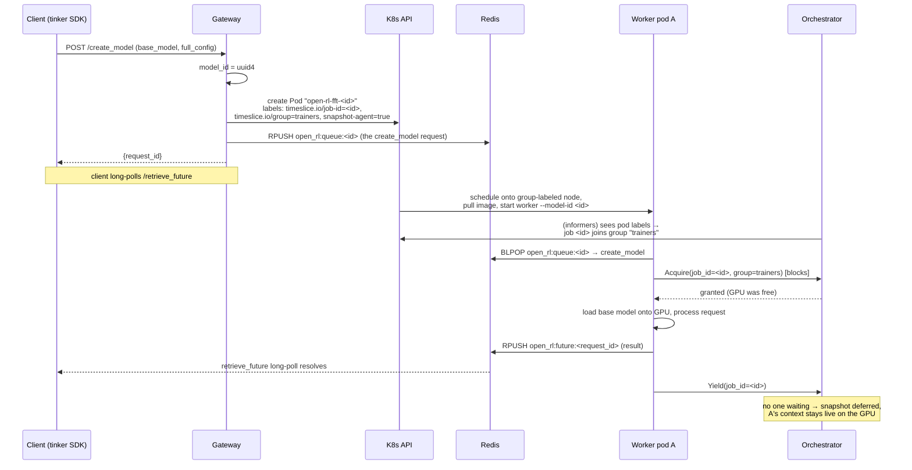

# GKE FFT Time-Slicing Setup Guide

This guide deploys open-rl in **FFT time-slicing mode**: multiple full-fine-tuning
jobs share one GPU, each in its own dynamically launched worker pod, with
[llm-d-rl-time-slicing](https://github.com/llm-d-incubation/llm-d-rl-time-slicing)
serializing GPU access via cuda-checkpoint. It is the cluster equivalent of the
single-node snapshot agent (`src/snapshot_agent/serve.py`) exercised by
`make test e2e fft-gsm8k-x2`.

## How it maps onto the cluster

| Single node | Cluster |
| --- | --- |
| Gateway `Popen`s one worker process per FFT model | Gateway creates one worker **pod** per model (`server/k8s_worker_manager.py`) |
| Snapshot agent unix socket, keyed by pid | Accelerator orchestrator gRPC (`Acquire`/`Yield`), keyed by `timeslice.io/job-id` + `timeslice.io/group` pod labels |
| Local `cuda-checkpoint` invoked by the agent | Privileged snapshot-agent DaemonSet runs `cuda-checkpoint` against the worker pod's pids |
| `OPEN_RL_TMP_DIR=/tmp/open-rl` on local disk | `OPEN_RL_TMP_DIR=/mnt/shared/open-rl` on a ReadWriteMany Filestore PVC |

The per-model Redis work queues and the futures protocol are unchanged. The
worker selects the orchestrator client when `OPEN_RL_TIME_SLICE_ORCHESTRATOR_ADDR`
is set; otherwise it uses the local unix-socket agent, so single-node dev is
unaffected.

## Architecture and lifecycle

| Component | Runs as | Talks to | Job |
| --- | --- | --- | --- |
| Gateway | Deployment (CPU-only) | Redis, k8s API | Accepts Tinker API calls, mints model_ids, creates worker pods; never touches a GPU |
| Redis | Deployment | — | Per-model work queues + futures (the data plane) |
| FFT worker | One Pod per model, created by the gateway | Redis, orchestrator | Holds the model on the GPU, drains its queue, trains |
| llm-d orchestrator | Deployment in `timeslice-system` (gRPC :50051) | k8s API (informers), snapshot agents | The GPU lock manager: grants `Acquire`, drives snapshot/restore |
| llm-d snapshot agent | DaemonSet (privileged, hostPID) per GPU node (gRPC :9001) | NVML, `cuda-checkpoint` | Freezes/thaws a pod's GPU context on the orchestrator's command |
| Shared PVC (`/mnt/shared`) | Filestore/Lustre RWX, mounted everywhere | — | Checkpoints, sampler weights, HF cache |

Standing state before any job: the GPU node carries the
`group.timeslice.io/trainers=true` label (membership in the time-slice group)
and the node pool allows two pods to each claim `nvidia.com/gpu: 1`
(time-sharing).

### Act 1 — a job is born



The gateway's two writes (pod + queue item) are the entire job-creation act — it
never speaks to the orchestrator. The worker doesn't register anywhere either:
**its pod labels are its registration**. The orchestrator's informers watch pods,
see the three labels, and the job materializes in the group.

### Act 2 — a second job arrives and the GPU ping-pongs

A second `create_model` lands a second pod on the same node (second time-share
slot). Both workers loop forever: `BLPOP own queue → Acquire → process batch →
Yield`. The first time B wants the GPU while A's context is live:

```mermaid
sequenceDiagram
    participant WA as Worker A
    participant WB as Worker B
    participant O as Orchestrator
    participant SA as Snapshot Agent (on node)
    participant GPU as GPU

    WB->>O: Acquire(job-B, trainers)  [blocks]
    Note over O: A yielded but its context is live<br/>(IDLE_YIELDED) → evict A first
    O->>SA: Snapshot(job-A)
    SA->>SA: find A's pod on this node by labels,<br/>NVML → host PIDs
    SA->>GPU: cuda-checkpoint: A's weights/optimizer/activations<br/>→ host RAM, GPU memory freed
    SA-->>O: operation COMPLETE (polled via GetOperation)
    O-->>WB: Acquire granted (context_restored=false, first run)
    WB->>GPU: load model B, train batch
    WB->>O: Yield(job-B)

    WA->>O: Acquire(job-A)  [next batch arrived in A's queue]
    O->>SA: Snapshot(job-B), then Restore(job-A)
    SA->>GPU: checkpoint B → RAM;  restore A: RAM → GPU
    O-->>WA: granted (context_restored=true)
    WA->>GPU: train batch — exactly where it left off
```

This is the cluster version of the local snapshot agent's FIFO, with three
upgrades: the lock is keyed by `(job_id, group)` labels instead of a local pid;
checkpoint/restore is driven by the orchestrator calling the node's DaemonSet
(workers only ever say Acquire/Yield); and `Yield` is lazy — with no waiters, no
snapshot happens, so a lone job pays zero overhead.

The client sees none of this. It long-polls `retrieve_future` against the
gateway; whichever worker currently owns the GPU pushes results into Redis as
batches complete. `save_state` checkpoints land on
`/mnt/shared/open-rl/checkpoints/<model_id>/...`, so a later
`create_model_from_state` — possibly serviced by a brand-new pod — can pick them
up.

> **Design note:** the Gateway → K8s API arrow in Act 1 couples the API tier to
> infrastructure (pod RBAC, kubernetes client in the request path). The planned
> follow-up replaces it with a standalone worker controller that watches Redis
> for "per-model queue has items, no matching worker pod" and reconciles —
> level-triggered, so launches lost to crashes are repaired on the next scan, and
> idle workers can be reaped. Every other arrow in both diagrams stays the same.

## Requirements

- GKE Standard cluster with the Filestore CSI driver enabled (see
  [gke-setup.md](gke-setup.md) for the base cluster, CPU pool, and PVC details).
- A GPU node pool whose **driver is r570 or newer** — `cuda-checkpoint` requires
  it. Use `--gpu-driver-version=latest` and verify with
  `nvidia-smi --query-gpu=driver_version --format=csv` on the node.
- GPU **time-sharing** on the node pool so two worker pods can each request
  `nvidia.com/gpu: 1` while llm-d serializes the actual usage.
- Helm v3 for the llm-d chart.

## 1. Create the time-sliced GPU node pool

```bash
gcloud container node-pools create gpu-timeslice \
  --cluster "${CLUSTER}" --zone "${ZONE}" \
  --machine-type g2-standard-24 \
  --accelerator "type=nvidia-l4,count=1,gpu-sharing-strategy=time-sharing,max-shared-clients-per-gpu=2" \
  --gpu-driver-version=latest \
  --node-labels="group.timeslice.io/trainers=true" \
  --num-nodes 1
```

Notes:

- `group.timeslice.io/trainers=true` opts the node into the llm-d time-slice
  group named `trainers` — the same group name baked into the gateway env and the
  worker pod template (`OPEN_RL_TIME_SLICE_GROUP`).
- `max-shared-clients-per-gpu` bounds how many FFT jobs can share the GPU.
  Size node RAM accordingly: each *suspended* job's full GPU state (weights,
  optimizer, activations) is parked in host memory by cuda-checkpoint.
- On non-GKE clusters, the equivalent is the NVIDIA device plugin's
  [time-slicing config](https://github.com/NVIDIA/k8s-device-plugin#shared-access-to-gpus-with-cuda-time-slicing)
  (`replicas: 2`) plus the node label above.

## 2. Install llm-d-rl-time-slicing

```bash
git clone https://github.com/llm-d-incubation/llm-d-rl-time-slicing
cd llm-d-rl-time-slicing/deploy
helm dependency update .
helm install timeslice . -n timeslice-system --create-namespace
```

This installs the **accelerator orchestrator** (Deployment + Service
`acceleratororchestrator`, gRPC :50051) and the **snapshot-agent DaemonSet**
(privileged, hostPID, gRPC :9001) into `timeslice-system`. Verify:

```bash
kubectl get pods -n timeslice-system
kubectl get svc acceleratororchestrator -n timeslice-system
```

The worker pod template points at
`acceleratororchestrator.timeslice-system.svc.cluster.local:50051`; adjust it in
`k8s/deploy/distributed-fft-timeslice/05-worker-pod-template.yaml` if you change
the release namespace or service name.

## 3. Build, push, and deploy open-rl

```bash
make build-images push-images
make deploy-fft-timeslice
```

`k8s/deploy/distributed-fft-timeslice/` deploys Redis, the shared PVC, and the
gateway with `OPEN_RL_ENABLE_FFT=true` and `OPEN_RL_WORKER_LAUNCHER=kubernetes`.
There is no static trainer worker: every `create_model` call makes the gateway
create a worker pod named `open-rl-fft-<model-id>`, labeled

```yaml
snapshot-agent: "true"          # picked up by the snapshot-agent DaemonSet
timeslice.io/group: trainers    # time-slice group membership
timeslice.io/job-id: <model-id> # identity used in Acquire/Yield
```

The gateway's `open-rl-sa` service account has a Role allowing pod CRUD in the
workload namespace (`03-rbac.yaml`).

## 4. Run the two-job e2e

```bash
kubectl port-forward svc/open-rl-gateway-service 8000:8000 &
make test e2e fft-gsm8k-x2 BASE_URL=http://127.0.0.1:8000
```

The scenario trains two gsm8k SFT jobs concurrently. Against an external
`BASE_URL` the local snapshot-agent log check is skipped, so verify the
interleaving on the cluster instead:

```bash
# Group status: locking job, waiter queue depth, per-agent job states
cd llm-d-rl-time-slicing && go build -o bin/rlts ./cmd/rlts
kubectl port-forward svc/acceleratororchestrator -n timeslice-system 50051:50051 &
./bin/rlts orchestrator status trainers

# Snapshot/restore activity per job
kubectl logs -n timeslice-system ds/timeslice-snapshot-agent | grep -i 'snapshot\|restore'

# Both worker pods exist and share the node
kubectl get pods -l app=open-rl-fft-worker -o wide
```

## Troubleshooting

- **Worker pod Pending**: the node pool lacks free time-shared GPU slots, or the
  `group.timeslice.io/trainers` label is missing from the node.
- **Acquire blocks forever / job FAULTED in `rlts status`**: cuda-checkpoint
  failed on the node (check the snapshot-agent DaemonSet logs and the driver
  version). A FAULTED context requires operator intervention — usually deleting
  the worker pod.
- **`create_model` future fails with a pod-create error**: check gateway logs and
  RBAC; the error message is propagated into the `RequestFailedResponse`.
- **First request after `create_model` is slow**: pod scheduling + image pull +
  model load all happen before the worker drains its queue; pre-pull the server
  image on the GPU node to cut this down.
