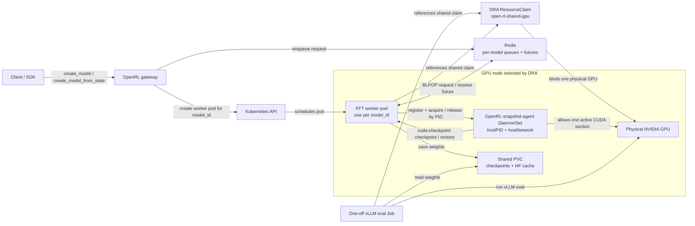
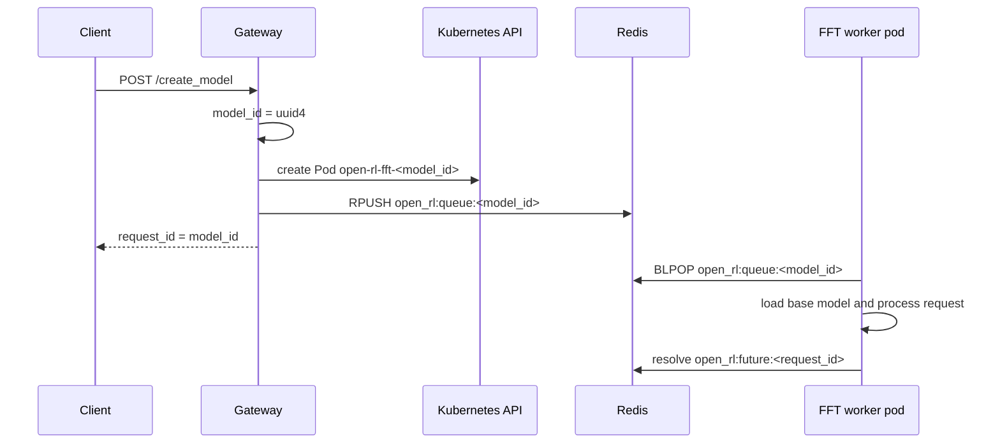

# GKE FFT DRA Worker Manager Setup Guide

This guide describes the core cluster shape introduced by this PR. It separates
three ideas that build on each other:

1. **DRA pinning:** one manually created `ResourceClaim` allocates one physical
   GPU, and every worker or eval pod that references that claim is scheduled onto
   the node that can access that same device.
2. **Kubernetes worker manager:** the gateway creates one FFT worker pod per
   `model_id`, instead of relying on a static trainer Deployment.
3. **OpenRL GPU coordination:** a node-local snapshot-agent DaemonSet
   coordinates checkpoint/restore so only one FFT worker enters a CUDA batch at
   a time on that node.

The eval manifest in `k8s/eval/` is a helper for validating saved checkpoints on
the same cluster, not the main behavior of this PR.

## Architecture at a glance

There are three separate responsibilities in this PR.

First, DRA is used only for GPU allocation and placement. The deployment creates
one `ResourceClaim` named `open-rl-shared-gpu`. FFT worker pods and the eval job
all reference that same claim. Kubernetes allocates one matching NVIDIA GPU to
the claim and schedules those pods onto a node where that device is available.
DRA does not serialize CUDA execution, perform checkpoint/restore, or decide
which process runs next.

Second, the Kubernetes worker manager is the deployment launcher. When the
gateway receives `create_model` or `create_model_from_state` in FFT mode, it
creates a pod for that `model_id` from the worker pod template, stamps the pod
name, labels, job-id env var, and `--model-id`, then enqueues the request on the
model-specific Redis queue. It is idempotent: if the worker pod for a model is
already running, it reuses it.

Third, the OpenRL snapshot agent is the runtime GPU coordinator. It runs as a
node-local DaemonSet on GPU nodes, with `hostPID` and `hostNetwork` enabled. FFT
worker pods connect to the agent on their node with
`OPEN_RL_SNAPSHOT_AGENT_HOST=status.hostIP` and
`OPEN_RL_SNAPSHOT_AGENT_PORT=9753`. The training processor registers its PID
with the agent and wraps GPU work in acquire/release calls. The agent keeps a
FIFO queue, allows one active process at a time, checkpoints on release, and
restores on acquire.

The request flow is:

1. A client calls `create_model`.
2. The gateway creates a unique `model_id`.
3. The Kubernetes worker manager ensures a worker pod exists for that model.
4. The worker pod references `open-rl-shared-gpu`, so Kubernetes places it on
   the DRA GPU node.
5. The gateway enqueues the create request on the model's Redis queue.
6. The worker drains that queue and uses the node-local snapshot agent before
   entering CUDA sections.

The whole system looks like this:


```mermaid
flowchart LR
    client["Client / SDK"]
    gateway["OpenRL gateway"]
    kube["Kubernetes API"]
    redis["Redis\nper-model queues + futures"]
    claim["DRA ResourceClaim\nopen-rl-shared-gpu"]
    eval["One-off vLLM eval Job"]

    subgraph node["GPU node selected by DRA"]
        worker["FFT worker pod\none per model_id"]
        agent["OpenRL snapshot-agent DaemonSet\nhostPID + hostNetwork"]
        gpu["Physical NVIDIA GPU"]
        pvc["Shared PVC\ncheckpoints + HF cache"]
    end

    client -->|"create_model / create_model_from_state"| gateway
    gateway -->|"create worker pod for model_id"| kube
    gateway -->|"enqueue request"| redis
    kube -->|"schedules pod"| worker

    worker -->|"references shared claim"| claim
    eval -->|"references shared claim"| claim
    claim -->|"binds one physical GPU"| gpu

    worker <-->|"BLPOP request / resolve future"| redis
    worker -->|"register + acquire / release by PID"| agent
    agent -->|"cuda-checkpoint checkpoint / restore"| worker
    agent -->|"allows one active CUDA section"| gpu

    worker -->|"save weights"| pvc
    eval -->|"read weights"| pvc
    eval -->|"run vLLM eval"| gpu
```

This PR does not add a standalone llm-d-style orchestrator. The orchestration is
currently cooperative: worker code calls acquire/release, and the OpenRL
snapshot agent serializes those calls with a FIFO lock. The Kubernetes worker
manager only launches pods; it is not the runtime time-slice scheduler.

The migration boundary is intentional. A future llm-d-backed implementation can
replace the OpenRL JSON socket client and PID-based agent with an adapter that
maps the same acquire/release boundary onto llm-d Snapshot/Restore RPCs by job
id. The DRA claim, pod labels, worker-manager pod launch path, and Redis
request flow should all remain useful.

## 1. DRA pins the GPU allocation

`k8s/deploy/distributed-fft-timeslice/06-gpu-resourceclaim.yaml` creates a
single namespace-scoped `ResourceClaim`:

```yaml
apiVersion: resource.k8s.io/v1
kind: ResourceClaim
metadata:
  name: open-rl-shared-gpu
spec:
  devices:
    requests:
    - name: gpu
      exactly:
        deviceClassName: gpu.nvidia.com
```

Worker pods and the eval job both reference that same claim:

```yaml
resources:
  claims:
  - name: shared-gpu
resourceClaims:
- name: shared-gpu
  resourceClaimName: open-rl-shared-gpu
```

Because this is a shared `ResourceClaim`, Kubernetes allocates a single matching
device to the claim and schedules all referencing pods where that allocated
device is accessible. Do not use a `ResourceClaimTemplate` for this PR's pinning
behavior: templates generate per-pod claims, which is the pattern for separate
devices.

DRA is the allocation and placement layer. It does not serialize CUDA execution
by itself. This PR is intentionally an oversubscription model: multiple worker
pods can reference the same GPU claim, and OpenRL decides which worker may touch
CUDA at a given time.

## 2. The gateway creates one FFT worker pod per model

The per-model Redis queues and future protocol are unchanged. The new behavior
is only how dedicated FFT workers are launched:


```mermaid
sequenceDiagram
    participant C as Client
    participant G as Gateway
    participant K as Kubernetes API
    participant R as Redis
    participant W as FFT worker pod

    C->>G: POST /create_model
    G->>G: model_id = uuid4
    G->>K: create Pod open-rl-fft-<model_id>
    G->>R: RPUSH open_rl:queue:<model_id>
    G-->>C: request_id = model_id
    W->>R: BLPOP open_rl:queue:<model_id>
    W->>W: load base model and process request
    W->>R: resolve open_rl:future:<request_id>
```

`server/k8s_worker_manager.py` renders the worker pod from the ConfigMap template
in `05-worker-pod-template.yaml`. It stamps:

- the pod name, derived from the model id
- worker labels, including `app=open-rl-fft-worker`
- time-slicing labels (`snapshot-agent=true`, `timeslice.io/group`,
  `timeslice.io/job-id`) that preserve the shape of a future coordinator
  integration
- `OPEN_RL_TIME_SLICE_JOB_ID`, aligned with the `timeslice.io/job-id` label
- `--model-id <model_id>`, so the worker drains only its own queue

Those labels intentionally match llm-d snapshot-agent discovery. The current
OpenRL agent registers worker PIDs directly, but a future llm-d-backed adapter
can use `timeslice.io/job-id` to map OpenRL acquire/release onto llm-d
Restore/Snapshot RPCs by job id.

The gateway still has a local subprocess launcher for VM development. Select the
cluster launcher with `OPEN_RL_WORKER_LAUNCHER=kubernetes`.

## 3. A node-local snapshot agent coordinates GPU windows

The deployment includes `07-snapshot-agent-daemonset.yaml`, which runs one
OpenRL snapshot agent on each trainer GPU node:

```yaml
hostPID: true
hostNetwork: true
command: ["uv", "run", "python", "-m", "snapshot_agent.serve"]
args: ["--listen-host", "0.0.0.0", "--port", "9753"]
```

The dynamically launched FFT worker pods run the normal training processor:

```yaml
command: ["uv", "run", "python", "-m", "server.training_requests_processor"]
```

The training processor uses:

- `OPEN_RL_SNAPSHOT_AGENT_HOST` from the pod's `status.hostIP`
- `OPEN_RL_SNAPSHOT_AGENT_PORT=9753`
- `cuda-checkpoint` from the server image for process-level CUDA
  checkpoint/restore inside the node-local agent

The result is deliberately close to the llm-d snapshot-agent shape: workers talk
to a host-level agent on their node, and that agent owns the in-memory queue and
checkpoint/restore state for processes sharing the physical GPU. The worker pod
currently sets `hostPID: true` so the PID it registers is valid from the
node-local agent's host PID namespace; replacing that with Kubernetes PID
discovery is a later hardening step.

## Optional: evaluate a checkpoint with vLLM

Training writes full FFT checkpoints into the shared OpenRL temp directory, for
example:

```text
/mnt/shared/open-rl/checkpoints/<model_id>/weights/<name>
```

The cluster eval helper deploys a one-off vLLM Job that reads that path directly
from the shared PVC. The Python implementation lives in the server image
(`server.scripts.run_vllm_eval`); the Kubernetes YAML only configures the Job:

```bash
make cluster-eval EVAL_MODEL_PATH=/mnt/shared/open-rl/checkpoints/<model_id>/weights/final
```

The eval job also references `open-rl-shared-gpu`, so it is pinned to the same
physical GPU allocation as the training workers. It is intentionally out of
band: it does not require gateway sampling behavior, session binding for
sampling, or worker reload logic for sampler checkpoints. It does not currently
participate in the OpenRL snapshot-agent protocol, so run it when training is
quiet.

## Requirements

- GKE Standard cluster on **1.35 or newer** ([DRA for GPUs](https://docs.cloud.google.com/kubernetes-engine/docs/how-to/set-up-dra)
  needs it) with the Filestore CSI driver enabled (see
  [gke-setup.md](gke-setup.md) for the base cluster, CPU pool, and PVC details).
- A working NVIDIA GPU driver on the DRA node. The OpenRL snapshot path uses
  `cuda-checkpoint --action lock/checkpoint/restore/unlock`, so use driver
  **r570 or newer**.
- The **NVIDIA DRA GPU driver** (Helm chart `nvidia-dra-driver-gpu` >= 25.8.0)
  so all worker pods can share one GPU through a single `ResourceClaim`.
- Helm v3 for the DRA-driver chart.

## Setup 1: Create the DRA GPU node pool

Worker pods share the GPU through the `open-rl-shared-gpu` `ResourceClaim`
(`06-gpu-resourceclaim.yaml`) instead of device-plugin time sharing, so the node
pool disables the default device plugin and automatic driver install (per the
[GKE DRA setup guide](https://docs.cloud.google.com/kubernetes-engine/docs/how-to/set-up-dra);
follow it if these flags have drifted):

```bash
gcloud container node-pools create gpu-dra \
  --cluster "${CLUSTER}" --zone "${ZONE}" \
  --machine-type g2-standard-24 \
  --accelerator "type=nvidia-l4,count=1,gpu-driver-version=disabled" \
  --node-labels="group.timeslice.io/trainers=true,gke-no-default-nvidia-gpu-device-plugin=true,nvidia.com/gpu.present=true" \
  --num-nodes 1
```

Install the GPU driver manually. Use the `latest` installer so the
`cuda-checkpoint` command set is available:

```bash
kubectl apply -f https://raw.githubusercontent.com/GoogleCloudPlatform/container-engine-accelerators/master/nvidia-driver-installer/cos/daemonset-preloaded-latest.yaml
```

Then install the NVIDIA DRA driver, which is the kubelet plugin that discovers
GPUs and serves `ResourceClaim` allocations:

```bash
helm repo add nvidia https://helm.ngc.nvidia.com/nvidia
helm install nvidia-dra-driver-gpu nvidia/nvidia-dra-driver-gpu \
  --version="25.8.0" --create-namespace --namespace nvidia-dra-driver-gpu \
  --set nvidiaDriverRoot="/home/kubernetes/bin/nvidia/"
```

Notes:

- `group.timeslice.io/trainers=true` is the node label used by these manifests
  for the `trainers` group. It also matches the worker pod template's
  `OPEN_RL_TIME_SLICE_GROUP` value.
- The shared claim does not bound how many FFT jobs reference the GPU. The
  node-local OpenRL snapshot agent decides which FFT worker may run a CUDA batch
  at a time.
- Upstream caveat: DRA for GPUs is a supported GKE path on 1.35+, but GPU
  allocation is still marked experimental in the upstream
  [k8s-dra-driver-gpu](https://github.com/NVIDIA/k8s-dra-driver-gpu) repo. If
  it misbehaves or the cluster is pre-1.35, the fallback is device-plugin
  **time sharing**: create the pool with
  `--accelerator "type=nvidia-l4,count=1,gpu-sharing-strategy=time-sharing,max-shared-clients-per-gpu=2" --gpu-driver-version=latest`
  and only the `group.timeslice.io/trainers=true` label, skip the DRA driver
  install, and in `05-worker-pod-template.yaml` replace the
  `resources.claims`/`resourceClaims` stanzas with `nvidia.com/gpu: "1"`
  requests/limits. On non-GKE clusters the equivalent is the NVIDIA device
  plugin's [time-slicing config](https://github.com/NVIDIA/k8s-device-plugin#shared-access-to-gpus-with-cuda-time-slicing)
  (`replicas: 2`) plus the node label.

## Setup 2: Build, push, and deploy OpenRL

```bash
make build-images push-images
make deploy-fft-timeslice
```

`k8s/deploy/distributed-fft-timeslice/` deploys Redis, the shared PVC, the
shared GPU `ResourceClaim`, the node-local snapshot-agent DaemonSet, and the
gateway with `OPEN_RL_ENABLE_FFT=true` and
`OPEN_RL_WORKER_LAUNCHER=kubernetes`.
The deployment assumes one base model per rollout: set `BASE_MODEL` in
`kustomization.yaml`, and the gateway uses that value for `get_info` and
`create_model` requests that do not explicitly pass a base model.

There is no static trainer worker. Every `create_model` call makes the gateway
create a worker pod named `open-rl-fft-<model-id>`, labeled:

```yaml
snapshot-agent: "true"          # OpenRL/future coordinator marker
timeslice.io/group: trainers    # snapshot-agent group
timeslice.io/job-id: <model-id> # per-worker identity
```

The gateway's `open-rl-sa` service account has a Role allowing pod CRUD in the
workload namespace (`03-rbac.yaml`).

## Setup 3: Run training and evaluate on the cluster

```bash
kubectl port-forward svc/open-rl-gateway-service 8000:8000 &
make test e2e fft-gsm8k BASE_URL=http://127.0.0.1:8000
```

When the checkpoint path is on the cluster PVC and not visible from your local
machine, the e2e runner prints the corresponding eval command. You can also run
it directly:

```bash
make cluster-eval EVAL_MODEL_PATH=/mnt/shared/open-rl/checkpoints/<model-id>/weights/final
```

The eval job references the same DRA `ResourceClaim`, so it schedules onto the
same physical GPU allocation. Run it when training is quiet until eval also
participates in the OpenRL snapshot-agent protocol.

## Troubleshooting

- **Worker pod Pending**: the `open-rl-shared-gpu` `ResourceClaim` could not be
  allocated; the DRA driver isn't running, or no GPU node carries the
  `group.timeslice.io/trainers` label. `kubectl describe resourceclaim
  open-rl-shared-gpu` and `kubectl get pods -n nvidia-dra-driver-gpu` show why.
- **Additional worker pod Pending**: all workers reference the same
  `ResourceClaim`, so they should be schedulable onto the node that owns that
  claim. If only later pods are pending, check pod events for PVC attach limits,
  node selectors, taints, image pull errors, or an unallocated claim.
- **Worker fails on first CUDA batch with snapshot errors**: check the worker pod
  logs and the `open-rl-snapshot-agent` DaemonSet logs. The worker should connect
  to `OPEN_RL_SNAPSHOT_AGENT_HOST:OPEN_RL_SNAPSHOT_AGENT_PORT`,
  `cuda-checkpoint` must be on the agent `PATH`, and the node driver must support
  the requested checkpoint operations.
- **Eval job collides on GPU memory**: training workers participate in OpenRL's
  snapshot-agent protocol, but the one-off eval job does not yet. Run eval when
  training is quiet.
- **`create_model` future fails with a pod-create error**: check gateway logs and
  RBAC; the error message is propagated into the `RequestFailedResponse`.
- **First request after `create_model` is slow**: pod scheduling, image pull, and
  model load all happen before the worker drains its queue; pre-pull the server
  image on the GPU node to cut this down.
