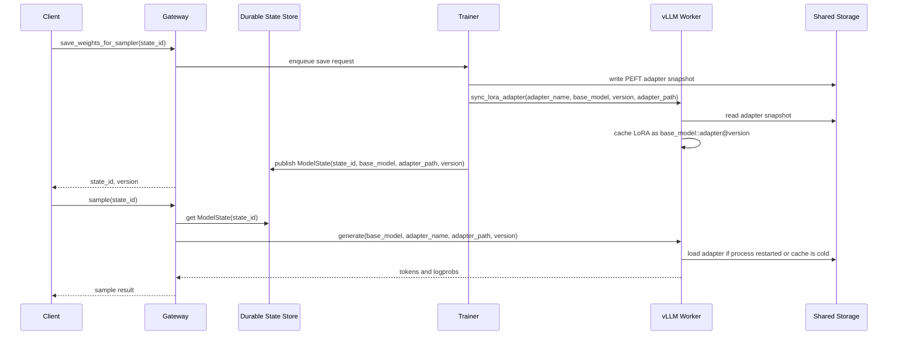
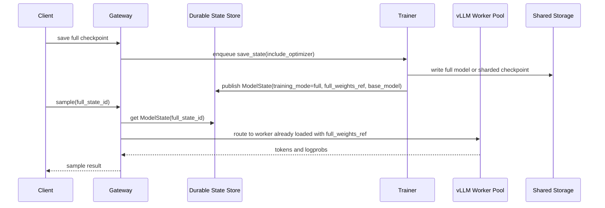

# vLLM State Recovery Demo

This is the near-term demo target for vLLM-backed Open-RL:

1. LoRA training publishes versioned sampler states through durable adapter
   snapshots.
2. The gateway routes sampling by `ModelState.base_model`, so two base models
   can share one Open-RL API server while using different vLLM workers.
3. A restarted trainer hydrates missing adapters from the latest checkpoint.
4. A restarted vLLM worker can load the latest LoRA adapter from the durable
   path sent by the gateway, even if the worker's in-memory sync table is empty.

This does not claim full fine-tune hot swapping inside one live vLLM process.
For FFT, the practical first demo is routing to a worker that is already loaded
with the requested full model checkpoint.

## LoRA Flow



The stale-cache fix is the versioned vLLM LoRA key:
`base_model::adapter_name@version`. The recovery fix is that the gateway sends
the durable adapter path and version from `ModelState`, so vLLM does not depend
on its own in-memory sync map after restart.

## Multi-Base Routing

Run one vLLM worker per loaded base model and point the gateway at them:

```bash
OPEN_RL_VLLM_ROUTES='{"google/gemma-4-e2b":"http://vllm-gemma:8001","Qwen/Qwen3-0.6B":"http://vllm-qwen:8001"}'
```

`save_weights_for_sampler` publishes `ModelState.base_model`, and `asample`
uses that field to choose the target worker. This is true multi-tenancy across
base models at the router level. It is not live base-model replacement inside a
single vLLM process.

## FFT Flow



The FFT version needs scheduler support: if no worker is loaded with the
requested full checkpoint, provision or resume one, then update routing. GCR can
fit as a runtime cache for the already-initialized worker image, with the
durable checkpoint remaining the source of truth.
