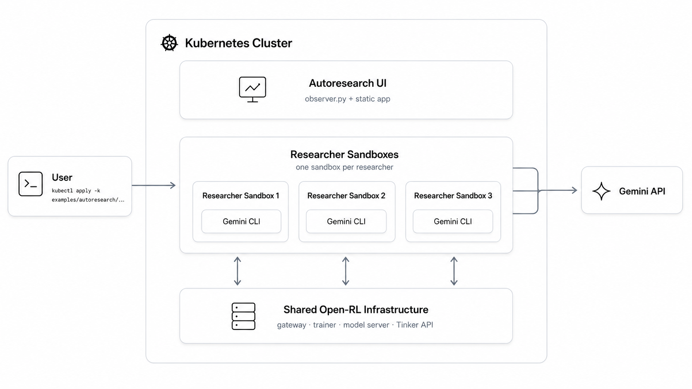

# OpenRL Autoresearch Demo

This adapts [Karpathy's autoresearch](https://github.com/karpathy/autoresearch)
to OpenRL: an agent repeatedly edits one allowed target, runs a bounded
measured attempt, keeps commits that improve the configured metric, and resets
the rest. The same recipe contract works locally or in Kubernetes; in a cluster,
each run can live in its own pod and act as an agent while sharing the same
storage and OpenRL backend.

## Minimal Recipe Shape

An autoresearch task needs three recipe-owned things:

```text
<recipe>/
  program.md          # instructions for the agent
  autoresearch.toml   # command, editable files, and graphed metric
  thing_to_edit.py    # often also the command target declared in TOML
```

`program.md` tells the agent what to edit, what metric matters, what files are
off-limits, and how to decide keep/reset.

`autoresearch.toml` is the harness contract. It says how to run one attempt,
which files the agent may edit, and which metric decides whether the attempt
improved:

```toml
task = "my_task"
command = "uv run recipe.py run_dir={run_dir} attempt_timeout_minutes={attempt_timeout_minutes}"
editable = ["thing_to_edit.py"]
metric = "accuracy"
metric_label = "accuracy"
metric_mode = "max"
```

The command can be any runnable benchmark or training loop. It just needs to:

- accept the args used in `command`, usually at least `run_dir`
- write attempt artifacts under `run_dir`
- exit nonzero on failure
- log the configured metric to `run_dir/metrics.jsonl`

Useful command placeholders are `{run_dir}` for the attempt artifact directory,
`{attempt_name}` for numeric attempt ids like `001`, and `{run_root}` for the
assembled `LOG_ROOT/RUN_NAME` directory.

```python
ml_logger.log_metrics({"accuracy": 0.73}, step=1)
```

Use the cookbook `ml_logger` for this; the shared harness treats
`metrics.jsonl` as the only metric source. The command target does not need a
special filename; it can be the editable recipe file itself, a fixed runner, or
`bash run.sh`.

## Included Recipes

Both recipes use the same `program.md` + `autoresearch.toml` contract:

| Recipe | Command Target | Editable | Metric | Guide |
| --- | --- | --- | --- | --- |
| Text-SQL | `recipes.text_sql.train` | `train.py` | `accuracy` | [Text-SQL](recipes/text_sql/README.md) |
| Math-RL | `recipes.math_rl.train` | `config.toml` | `accuracy` | [Math-RL](recipes/math_rl/README.md) |

Use the recipe guides for local one-attempt runs, local UI serving, and
recipe-specific settings.

## Run A Recipe

After the OpenRL backend and Agent Sandbox CRD exist, launch a named session
with the small CLI. From `examples/autoresearch`:

```bash
uv run python -m harness.cli recipes/text_sql session_name=alpha
```

That command creates an ignored generated overlay under `.runs/text-sql-alpha`,
copies the flat recipe directory into a ConfigMap, mounts it into the stable
agent image, sets the run config (`RECIPE`, `LOG_ROOT`, `RUN_NAME`, the
timeouts, and `TINKER_BASE_URL`), and runs `kubectl apply -k` for you.
`session_name` is required. The run directory is `<recipe>-<session>`, so this
example writes `RUN_NAME=text-sql-alpha`.

Launch another independent session from the same recipe by changing only
`session_name`:

```bash
uv run python -m harness.cli recipes/text_sql session_name=beta
```

The identity is `recipe directory + session_name`. Running the same recipe with
the same session name again is not a second job; it targets the same generated
overlay, Sandbox, and log directory. Running the same recipe with a different
session name creates a separate run directory such as `text-sql-beta`.

Preview without applying:

```bash
uv run python -m harness.cli recipes/text_sql \
  session_name=alpha \
  apply=False
```

Pass common recipe env directly:

```bash
uv run python -m harness.cli recipes/my_recipe \
  session_name=alpha \
  tinker_base_url=http://open-rl-gateway-service:8000
```

The recipe directory name becomes the package path under `recipes/`, so keep
`autoresearch.toml` consistent with that path. For example, a directory named
`my_recipe` should use paths like `recipes/my_recipe/train.py`. The CLI does
not configure model placement; vLLM and the trainer worker are configured by
the OpenRL backend deployment.

## Architecture

Autoresearch runs as a small Kubernetes add-on around the shared OpenRL
infrastructure. A recipe overlay starts the UI plus one agent Sandbox per
session. Each agent Sandbox runs Gemini CLI, edits the recipe, launches
attempts, and calls the shared OpenRL/Tinker services.



## Cluster Run

Use the normal [GKE setup guide](../../docs/setup/gke-setup.md) to create the
cluster, shared storage, vLLM worker, trainer worker, and OpenRL gateway, or
reuse an existing backend at `http://open-rl-gateway-service:8000`.

These manifests also require the official Agent Sandbox CRD:
`agents.x-k8s.io/v1alpha1/Sandbox`. Verify the CRD before applying a recipe:

```bash
kubectl api-resources | grep -i sandbox
```

Create the API secret for agent-backed pods:

```bash
kubectl create secret generic autoresearch-agent-secrets \
  --from-literal=GEMINI_API_KEY="${GEMINI_API_KEY}"
```

Start sessions with the CLI:

```bash
cd examples/autoresearch
uv run python -m harness.cli recipes/text_sql session_name=alpha
uv run python -m harness.cli recipes/text_sql session_name=beta
```

For Math-RL:

```bash
uv run python -m harness.cli recipes/math_rl session_name=alpha
```

The CLI-generated overlay starts one Sandbox that runs one Gemini CLI
agent. Underneath, the CLI writes `.runs/<recipe>-<session>/` and runs
`kubectl apply -k` against that generated overlay. If the agent process exits
nonzero or the pod crashes, the run stops; Kubernetes does not retry it. The
intended recovery is to inspect the UI/logs and start a new run explicitly.

Open the UI:

```bash
kubectl port-forward svc/open-rl-autoresearch-ui 8080:8080
```

The UI service is shared. It scans every run directory under `LOG_ROOT`, so the
same browser can show `text-sql-alpha`, `text-sql-beta`, and `math-rl-alpha`
together.

```text
http://localhost:8080/
```

Agent pods use a shared init container to wait for vLLM, the trainer
worker, and the gateway before the agent starts.

## Shared Pieces

```text
harness/cli.py         # creates/applies a generated overlay for a recipe dir
harness/agent.py       # prepares git, records baseline, launches Gemini
harness/attempt.py     # runs one measured attempt and writes metadata.json
harness/serve.py       # read-only UI server over agent/attempt manifests
harness/utils.py       # shared JSON, git, hashing, process helpers
k8s/base/              # reusable Sandbox/UI resources
```

Each agent creates a fresh git workspace under its work dir before
launching the agent. The image is self-describing: the harness and Python
dependencies live at `/app`, the built-in recipes at `/app/autoresearch`, and
`PYTHONPATH` is baked in, so the run config carries only run-specific values.
Recipe code comes from `RECIPE_DIR` on shared storage when set, otherwise from
the built-in image recipe. The selected recipe directory is copied into the
workspace at `RECIPE`'s parent and committed as the run baseline. That lets the
image stay stable while recipe files come from shared storage.

`harness.attempt` runs recipe code and writes artifacts under
`LOG_ROOT/RUN_NAME`. The UI scans each child run directory under `LOG_ROOT` and
reads agent manifests and attempt manifests from the run artifact tree. The
on-disk directory is still named `researchers/` for compatibility with existing
runs. Clearing `LOG_ROOT/RUN_NAME` resets that run.

The launcher records the unmodified default config as attempt `000`, then passes
the recipe-adjacent `program.md` to Gemini as the prompt. That program tells the
agent to edit only the declared target, commit the attempt, run
`eval "${RUN_ATTEMPT_COMMAND}"`, record the metric, and reset if the metric did
not improve.

## Adding A Recipe

Copy one existing recipe directory and update:

- `program.md`
- `autoresearch.toml`
- the command target, if you keep one
- the editable target
- optionally `kustomization.yaml`, only if you want a checked-in static overlay
  in addition to the CLI-generated overlay

The shared wrapper handles logs, diffs, metrics, status, and UI manifests.
Recipe code should focus on running the benchmark or training loop and emitting
the metric.

## Timeouts And Cleanup

`ATTEMPT_TIMEOUT_MINUTES` caps one measured training/eval run. Every attempt gets
the same value, so scores are comparable.

`AGENT_TIMEOUT_MINUTES` caps the outer Gemini process. One agent can run several
attempts inside this window: run the default config, edit, commit, run attempt,
decide keep/reset, then repeat. Setup happens before this clock starts.

Clean up a session:

```bash
OVERLAY=examples/autoresearch/.runs/text-sql-alpha \
  examples/autoresearch/cleanup_research_session.sh
```

To also clear shared run data:

```bash
DELETE_ARTIFACTS=1 \
LOG_ROOT=/mnt/shared/open-rl/autoresearch \
RUN_NAME=text-sql-alpha \
OVERLAY=examples/autoresearch/.runs/text-sql-alpha \
  examples/autoresearch/cleanup_research_session.sh
```
