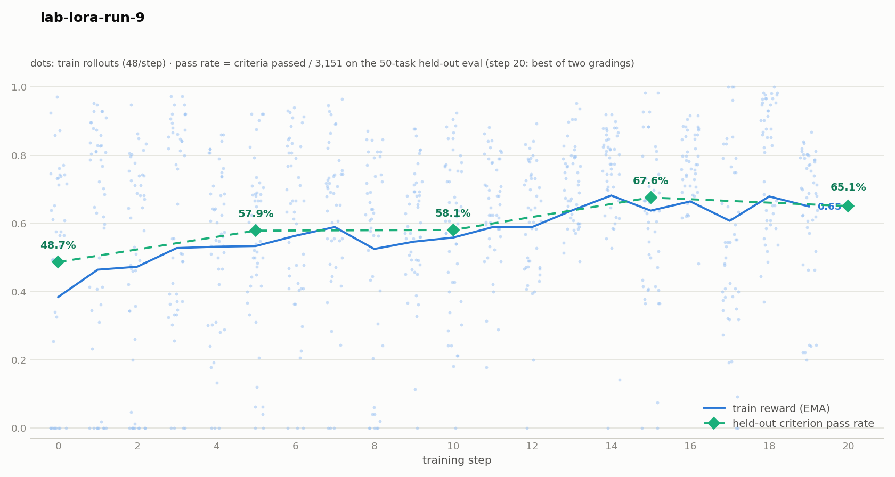

# Harvey LAB RL

Live-rollout RL on Harvey's Legal Agent Benchmark: the model works real LAB
tasks in a podman sandbox (documents, shell, file tools), a judge grades the
rubric, and the pass fraction is the reward. Training reuses tinker-cookbook's
GRPO loop and multi-turn tool environment.

## Results

Run 9 (Qwen3.5-9B LoRA, 20 steps, batch 8×6 rollouts, GLM judge): held-out
criterion pass rate 48.7% → **67.6%** (peak, step 15), 65.1% at the final
checkpoint — 3,151 pooled rubric criteria over the 50-task eval split.



## Layout

- `train.py` — run config and entrypoint (grading preflight, final eval).
- `tasks.py` — task discovery and reproducible, family-disjoint train/eval splits.
- `eval_checkpoint.py` — evaluate any saved adapter checkpoint.
- `prompts.py` — system prompt, skills, output-path contract.
- `env.py` — assemble cookbook tool environments and train/eval datasets.
- `sandbox.py` — cookbook sandbox protocol extension, factory, and default Podman adapter.
- `episode.py` — per-episode criterion accounting and failure diagnostics.
- `cookbook_compat.py` — scoped workarounds for missing cookbook configuration hooks.
- `reward.py` — rubric reward wrapper around LAB's judge.
- `tools.py` — LAB `ToolExecutor` adapter.
- `gemma4_renderer.py` / `qwen35_renderer.py` — tool-call rendering that preserves sampled history.
- `results.py` — canonical text/JSON run summary and shared metrics reader.
- `plot_run.py` — standard plot using the same results reader.
- `score_lab_run.py` — grading shim executed inside the LAB venv.

## Setup

The recipe is a client of an existing Open-RL gateway. Install the client
and LAB sandbox environment:

```bash
uv --project examples sync
examples/harvey_labs/setup_lab.sh
```

The LAB setup clones the harness next to the recipe and prepares podman,
pandoc, and the sandbox image. Configure the judge key (`GEMINI_API_KEY`, or
credentials for `judge_model`) and `ANTHROPIC_API_KEY` for LAB's deliverable
matcher. The recipe checks the grading environment before training starts.

Pass `base_url=<gateway-url>` when running remotely. Ensure the deployed
sampler supports the requested `max_trajectory_tokens` context window.

## Run

```bash
TINKER_API_KEY=tml-dummy-key \
uv --project examples run --no-sync python -m harvey_labs.train \
  model_name=Qwen/Qwen3.5-9B \
  base_url=http://127.0.0.1:9003 \
  learning_rate=2e-4 lora_rank=32 \
  batch_size=8 rollouts_per_example=6 max_steps=20 eval_every=5 \
  max_tokens=16384 max_trajectory_tokens=131072 max_tool_result_tokens=16384 \
  log_path=artifacts/harvey-labs/my-run
```

`task_set=random` keeps the held-out slice fixed as `train_tasks` changes
(defaults: `train_tasks=300 eval_tasks=50 task_split_seed=0`). Scenario
siblings of an eval task are excluded from training. `task_set=family`
stratifies eval across practice areas. Keep the task set, seed, judge, and
rollout count fixed when comparing runs. `task=<name>` selects one task for
smoke tests.

`eval_rollouts_per_task=4` averages multiple rollouts per held-out task.
`eval_at_step_0=true` measures an untrained baseline; `final_eval=true`
measures the final checkpoint. `stream_minibatches=true` overlaps training
with sampling (one optimizer update per batch at `num_substeps=1`). Its log
shows `Substep 1/1, Minibatch 1/8` through `8/8`; these identify the item
about to be trained, not completed requests. Stored batch and trace IDs
remain zero-based.

## Custom sandboxes

The Python training and standalone evaluation entry points accept a factory:

```python
from harvey_labs.train import RunConfig, run
from my_backend import sandbox_factory

await run(RunConfig(...), sandbox_factory=sandbox_factory)
```

The same factory is used for train, held-out eval, and final eval. It receives
one `SandboxRequest` per rollout with a unique run ID, input documents,
prepared skill scripts, and a local output directory. The CLI keeps Podman
as its default; custom factory injection is currently a Python API.

Return an object implementing `LabSandbox`, which extends cookbook's
`SandboxInterface` (`sandbox_id`, `run_command`, `read_file`, `write_file`,
`send_heartbeat`, `cleanup`) with LAB tool definitions, `execute_tool`,
`tool_metrics`, and async `collect_outputs(destination)`. The factory must
create an isolated workspace and provision the LAB paths and dependencies
specified in `SandboxRequest`. Remote backends must arrange a lease or
heartbeat for the episode lifetime and implement LAB's tool semantics,
including glob/grep; the upstream LAB executor assumes local bind mounts.

Before grading, `collect_outputs` materializes deliverables in the local
output directory, preserving binary files and rejecting escaping paths or
symlinks. Podman already writes there through its bind mount. The judge
continues to run locally in the LAB environment.

Factories clean up resources if creation fails or is cancelled before they
return. After return, the environment group owns cleanup, including partial
startup and assembly failures. Podman is the only bundled backend; custom
backend integration is covered with a fake sandbox in the client tests.

`log_full_rollouts=true` uses cookbook's standard detailed trajectory printer;
the default retains the recipe's concise console summary. Both modes keep
cookbook's rollout artifacts and the canonical results report.

## Consume results

Use these entry points for people and agents:

```bash
uv --project examples run --no-sync python -m harvey_labs.results artifacts/harvey-labs/my-run
uv --project examples run --no-sync python -m harvey_labs.results artifacts/harvey-labs/my-run --json
uv --project examples run --no-sync python -m harvey_labs.plot_run artifacts/harvey-labs/my-run
```

Training generates `results.json` and `run_plot.png` when it ends, including
partial runs with metrics after a failure. The saved files are snapshots;
run the command again for current results while training is active. Add
`--metrics` to the JSON command to include all original metrics, including
timings, entropy, and grading errors. Extend `results.read_results` and the
standard plotter for additional analyses instead of adding another parser.

Both commands use **completed training batches** as their step coordinate:
training batch 0 finishes at 1, its pre-update eval measures 0, and the
final eval measures the checkpoint's completed-batch count. Reports handle
both `step` and `progress/batch` records and both historical metric namespaces.
Pooled criterion pass rates are distinguished from legacy averages of
per-episode fractions. Final eval is identified only by an explicit marker;
older final records still appear under latest/best eval and in the plot.

Detailed artifacts remain in `metrics.jsonl`,
`iterations/iteration_*/` (transcripts and rollout summaries), and
`<lab_root>/results/<run-id>/scores.json` (rubric verdicts).

Evaluate a base model or an adapter separately with
`python -m harvey_labs.eval_checkpoint`, using the same model and evaluation
settings. An empty `checkpoint` evaluates the base model. An adapter
`checkpoint=<directory>` must be accessible to the gateway; an external
path also needs `model_id=<live-model-id>` for the existing symlink workflow.

## Troubleshooting

- **Rollouts are `<pad>` streams** (logprobs exactly `-0.1`): sampler is in
  mock mode — vllm failed to import in that process.
- **Empty completions / `leaves no room in max_model_len`**: sampler context
  smaller than `max_trajectory_tokens`.
- **Rubric scores all zero**: judge key missing or stale LAB venv
  (`uv sync` inside the LAB checkout).
- **Episodes end after one turn with no tool call**: renderer/template
  mismatch for the model family.
- **CUDA OOM in training**: `PYTORCH_CUDA_ALLOC_CONF=expandable_segments:True`,
  `OPEN_RL_TRAIN_TOKEN_BUDGET`, `OPEN_RL_ACTIVATION_CPU_OFFLOAD=1` (all on
  the gateway). Knob reference: [docs/configuration.md](../../docs/configuration.md).
- **Podman**: rootless podman needs `XDG_RUNTIME_DIR` in detached shells;
  sweep leaked containers with `podman rm -f $(podman ps -aq)`; small root
  disks need `graphroot` moved before pulling the sandbox image.

Run the client recipe checks without starting infrastructure:

```bash
uv --project examples run --no-sync --with pytest pytest \
  tests/test_harvey_renderer.py tests/test_harvey_task_split.py \
  tests/test_qwen35_verbatim_renderer.py tests/test_harvey_results.py tests/test_harvey_sandbox.py -q
```

The Qwen checks load the real tokenizer (cached locally or downloaded from
Hugging Face); they do not load model weights or require a GPU.
