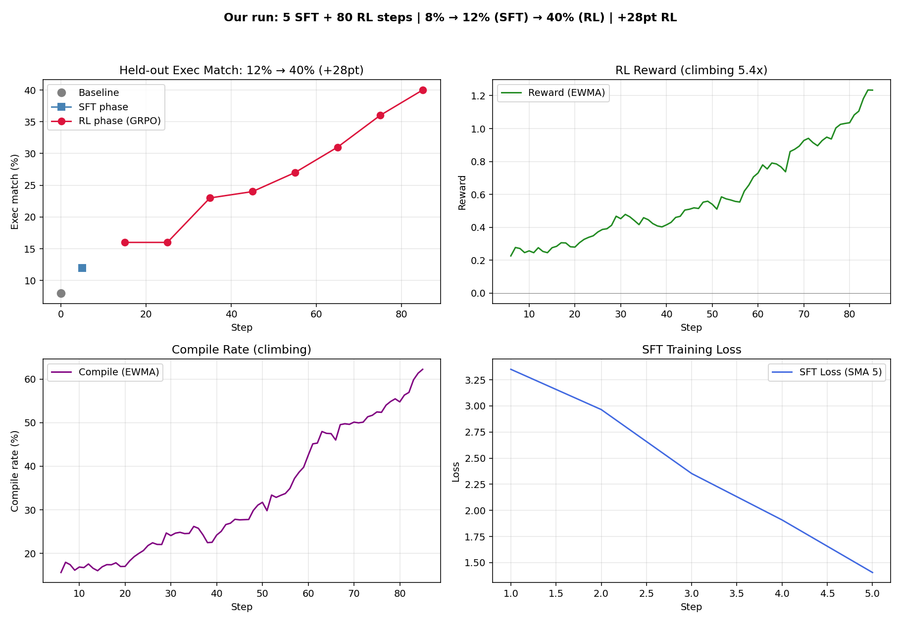

# Text-to-SQL SFT + RL Recipe

This guide documents the current known-good `google/gemma-4-e2b` recipe for
`examples/rl/text-to-sql/texttosql_sft_grpo.py`.

The recipe consists of SFT and RL phases on the Gretel synthetic text-to-SQL dataset:

- Dataset: `philschmid/gretel-synthetic-text-to-sql`
- Model: `google/gemma-4-e2b`
- Sampler: vLLM `0.19.1`, no Open-RL BOS prepend shim
- Preset: `gemma4_e2b_rl_recipe`
- Seed: `42`
- SFT: `5` steps, `100` SFT examples, lr `5e-5`
- RL: `80` steps, `8` prompts x `8` samples per step, lr `5e-6`
- Reward: compile `0.25`, match `2.0`, error penalty `-0.25`,
  similarity `1.0`
- Eval: `100` held-out examples with executable, non-empty target rows

## Result

Latest clean run:

```text
baseline exec:  8%
after SFT:     12%
after RL:      40%
RL gain:      +28pt

baseline exact: 4%
after SFT:     6%
after RL:     10%
```




The metrics and recipe log for this run are in:

```text
examples/rl/text-to-sql/artifacts/texttosql_sft_grpo_gemma4_e2b_rl_recipe_sft5_train100_vllm0191_no_bos/
```

## Step-by-Step Guide to Running the Recipe

This guide assumes you have already cloned the repository. It is optimized for a machine with at least two GPUs, allowing you to run the sampler and gateway on separate devices.

### Step 1: Install `uv` (if not already installed)

`uv` is a fast Python package installer and resolver used in this project.

```bash
curl -LsSf https://astral.sh/uv/install.sh | sh
```

Restart your shell or source your profile to make `uv` available in your PATH.

### Step 2: Patch vLLM for Gemma 4

Run the patch script to avoid duplicate module issues with Gemma 4 in vLLM. The script will automatically check if the patch is needed and apply it, or report if it is already in place.

```bash
cd src/server
uv run --extra vllm python scripts/patch_vllm_lora_dedup.py
```

### Step 3: Start the Server

You need to start two components in separate terminals (or `tmux` panes): the vLLM sampler and the Open-RL gateway. We will assign one GPU to each process to avoid memory contention.

#### Terminal 1: vLLM Sampler

Start the vLLM sampler on GPU 0. By default, it will listen on port 8001.

```bash
CUDA_VISIBLE_DEVICES=0 make vllm BASE_MODEL=google/gemma-4-e2b
```

#### Terminal 2: Gateway + Trainer

Start the gateway on GPU 1. It defaults to port 9003 and connects to the vLLM sampler at `http://127.0.0.1:8001`.

```bash
CUDA_VISIBLE_DEVICES=1 make server BASE_MODEL=google/gemma-4-e2b SAMPLER=vllm
```

### Step 4: Run the Training

Here are the two main ways to run the training:

#### Option A: RL Only (Recommended if you have a pre-trained SFT adapter)

Run only the RL phase, skipping the SFT warmup. By default, this starts from a fresh LoRA.

```bash
cd examples/rl/text-to-sql
TINKER_BASE_URL=http://127.0.0.1:9003 TINKER_API_KEY=tml-dummy uv run python texttosql_sft_grpo.py gemma4_e2b_rl_recipe phase=rl_only
```

#### Option B: Full Run (SFT + RL)

Run both the SFT warmup and the RL phase sequentially.

```bash
cd examples/rl/text-to-sql
TINKER_BASE_URL=http://127.0.0.1:9003 TINKER_API_KEY=tml-dummy uv run python texttosql_sft_grpo.py gemma4_e2b_rl_recipe
```

If you want to load a specific pre-trained SFT adapter for the RL-only phase, you can pass its name:

```bash
cd examples/rl/text-to-sql
TINKER_BASE_URL=http://127.0.0.1:9003 TINKER_API_KEY=tml-dummy uv run python texttosql_sft_grpo.py gemma4_e2b_rl_recipe phase=rl_only sft_adapter_name=your-sft-adapter-name
```

Relevant preset defaults:

```text
seed=42
sft.steps=5
sft.eval_every=5
sft.learning_rate=5e-5
dataset.train_limit=100
rl.steps=80
rl.eval_every=10
rl.loss_fn=ppo
rl.kl_coeff=0.1
rl.clip_range=0.2
rl.learning_rate=5e-6
rl.prompts_per_step=8
rl.samples_per_prompt=8
dataset.rl_train_limit=5000
dataset.eval_limit=100
reward.compile=0.25
reward.match=2.0
reward.error_penalty=-0.25
reward.similarity=1.0
```

## Plot

Generate the 4-panel curve:

```bash
cd examples/rl/text-to-sql
uv run python plot_ttsql_curves.py \
  artifacts/texttosql_sft_grpo_gemma4_e2b_rl_recipe_sft5_train100_vllm0191_no_bos/metrics.jsonl \
  artifacts/texttosql_sft_grpo_gemma4_e2b_rl_recipe_sft5_train100_vllm0191_no_bos/curves.png
```

The plotter reads `metrics.jsonl` and renders:

- held-out execution match
- RL reward EWMA
- compile-rate EWMA
- SFT loss

## Clean State Between Runs

Adapters and checkpoints are reused by name, so clear state when comparing
recipes:

```bash
rm -rf examples/rl/text-to-sql/artifacts/texttosql_sft_grpo_gemma4_e2b_rl_recipe_sft5_train100_vllm0191_no_bos
rm -f /tmp/open-rl/checkpoints/gemma4_e2b_rl_recipe-*
rm -rf /tmp/open-rl/peft/*
```

Use the PEFT wipe when you want to remove every cached LoRA adapter. For routine
reruns, clearing the artifact directory and recipe checkpoints is usually enough.

## What To Expect

In the clean run:

```text
baseline eval @ step 0:
execution_match=8%, exact_match=4%, similarity=0.372

SFT eval @ step 5:
execution_match=12%, exact_match=6%, similarity=0.494
```

### Example Before/After SFT

```text
Question:
What is the total weight of all shipments in the 'Beijing' warehouse?

Base response:
question: what is the total weight of all shipments in the 'beijing' warehouse? sql: ...

After 5 SFT steps:
select sum(weight) from shipment where warehouse_id = 1

Target:
select sum(weight) from shipment s join warehouse w
on s.warehouse_id = w.id where w.city = 'beijing'
```
