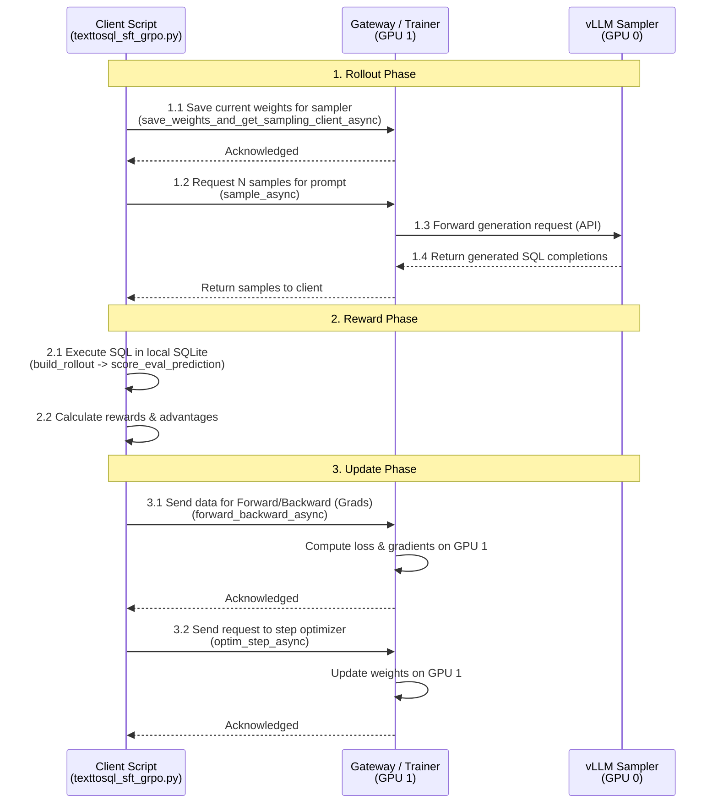

# Text-to-SQL RL Recipe

## Overview

This recipe provides a complete guide to fine-tuning a base LLM model to generate correct SQL queries from natural language questions, optimizing specifically for execution correctness (i.e., the generated SQL returns the correct result when executed).

- **Base Model**: [google/gemma-4-E2B](https://huggingface.co/google/gemma-4-E2B)
- **Dataset**: [philschmid/gretel-synthetic-text-to-sql](https://huggingface.co/datasets/philschmid/gretel-synthetic-text-to-sql)

The **goal** is to demonstrate how to use the OpenRL infrastructure to run training locally on a single machine with multiple GPUs. This provides a baseline and understanding before scaling to a distributed Kubernetes (K8s) cluster in later guides.

**What the core script does**: The core training script [texttosql_sft_grpo.py](texttosql_sft_grpo.py) orchestrates the training loop. It performs the following actions:
*   Calls our OpenRL server (gateway) to request samples from vLLM.
*   Executes the generated SQL queries in a local SQLite database to compute rewards.
*   Sends these rewards back to the server to update the LoRA adapter weights via the trainer.

<details>
<summary><b>Sequence Diagram</b></summary>

This sequence diagram illustrates the interaction between the client script, the gateway/trainer, and the vLLM sampler during the RL training phase, noting the key functions called.


</details>


## Setup

Before running the training, you need to set up the environment and deploy OpenRL. You can choose to run it locally on a VM with multiple GPUs or on a GKE cluster.

*   For **Local Setup** (recommended for baseline), follow the [Local Setup Guide](../../docs/setup/local-setup.md).
*   For **GKE Setup** (recommended for scaling), follow the [GKE Setup Guide](../../docs/setup/gke-setup.md).

After completing the setup and ensuring the gateway and vLLM sampler are running, proceed to the training section below.


## Running the Training

Open a **third terminal session** to run the training script.

### 1. Common Environment Variables

You can copy and paste these into your training terminal before proceeding.

```bash
# OpenRL Gateway URL
export TINKER_BASE_URL=http://127.0.0.1:9003

# Dummy API key for local gateway
export TINKER_API_KEY=tml-dummy

# Recommended to avoid Hugging Face rate limits
# export HF_TOKEN="your_huggingface_token"
```

### 2. Execute Training

Set the `MODE` environment variable to control how the script runs.

Supported modes with known-good configurations:
*   **`full`**: Runs both SFT (`5` steps on `100` examples, learning rate `5e-5`) and RL (`80` steps, `8` prompts x `8` samples per step, learning rate `5e-6`).
*   **`rl_only`**: Skips SFT and runs only RL (`80` steps, `8` prompts x `8` samples per step, learning rate `5e-6`) from the base model.

```bash
# Option 1: Full SFT + RL (Default)
export MODE="full"

# Option 2: RL Only (from scratch)
# export MODE="rl_only"

# Run training
(cd examples/text-to-sql && \
 uv run python texttosql_sft_grpo.py gemma4_e2b_rl_recipe phase=$MODE)
```

## Results

After training, you can plot the metrics. Run this from the repository root. We use the `$MODE` variable to point to the correct artifact directory.

```bash
(cd examples/text-to-sql && \
 uv run python -m utils.plot \
   artifacts/texttosql_sft_grpo_gemma4_e2b_rl_recipe_$MODE/metrics.jsonl)
```

The plotter renders several curves to help you understand training progress:
*   **Execution Match**: The percentage of generated SQL queries that returned the correct result when executed. This is the primary metric for success.
*   **RL Reward EWMA**: The Exponentially Weighted Moving Average (smoothed average) of the RL reward.
*   **Compile Rate EWMA**: The smoothed rate at which generated SQL queries were successfully compiled by the database.
*   **SFT Loss**: The loss during the Supervised Fine-Tuning phase. It should decrease.

Here are the actual plots from known-good runs for each mode. Expand the sections below to see the plots and their interpretation.

<details>
<summary><b>RL Only Results</b></summary>

*   In this mode, training starts directly with RL without a prior SFT phase.
*   You should see the **Execution Match** curve start low (around 8%) and steadily increase as the model learns to generate correct SQL based on execution rewards.
*   The **Compile Rate** should also increase, showing the model learns valid SQL syntax.
*   The **RL Reward** should show an upward trend.


</details>

<details>
<summary><b>Full SFT + RL Results</b></summary>

*   In this mode, the model first undergoes SFT for 5 steps, which typically raises the baseline execution accuracy from ~8% to ~12%.
*   After SFT, the RL phase begins. You should see a significant jump in **Execution Match** during the RL phase, reaching around 40% in known-good runs.
*   The **SFT Loss** curve (usually shown in a separate plot or as part of the logs) should show a decrease during the first 5 steps.
*   This plot demonstrates the combined effect of format learning (SFT) and correctness optimization (RL).


</details>

## Advanced: Customizing the Run

If you want to experiment further, you can override default configurations by appending them to the command line:

```bash
(cd examples/text-to-sql && \
 uv run python texttosql_sft_grpo.py gemma4_e2b_rl_recipe sft.steps=10 rl.steps=100)
```

Common overrides:
*   `sft.steps=5`
*   `sft.learning_rate=5e-5`
*   `rl.steps=80`
*   `rl.learning_rate=5e-6`
*   `rl.prompts_per_step=8`
*   `rl.samples_per_prompt=8`

## Troubleshooting

*   **CUDA Out of Memory (OOM)**: If vLLM fails with OOM during startup, ensure you have enough VRAM and set a higher value for `VLLM_GPU_MEMORY_UTILIZATION` (e.g., 0.9).
*   **System Hangs during model loading**: Ensure you have at least 32GB of system RAM. Loading large models can overwhelm smaller RAM configurations.
