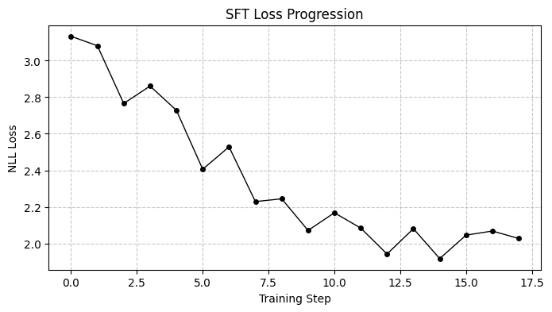
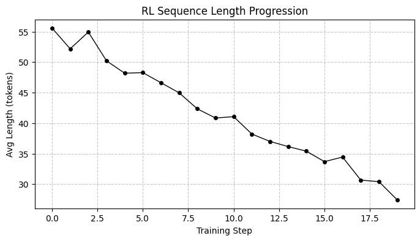
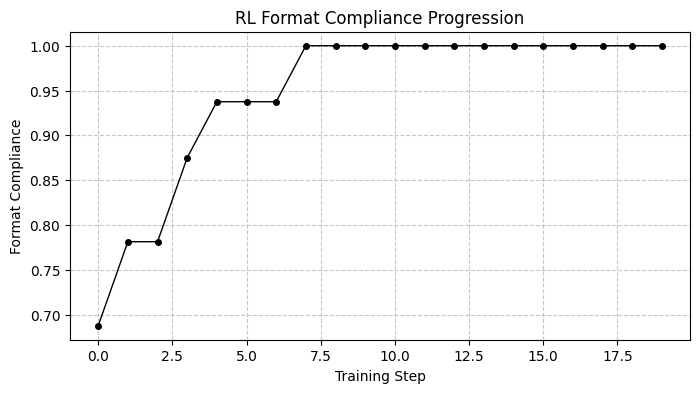

# Tinker Cookbook Recipes

Since Open-RL implements Tinker-compatible APIs, you can use
[`tinker-cookbook`](https://github.com/thinking-machines-lab/tinker-cookbook)
recipes with Open-RL endpoints.

## Setup

Assuming you have cloned this repository, install the example dependencies:

```bash
cd examples
uv sync
```

If you want to try other recipes, you may need to install other extras or dependencies.

## Start the Server

From the repository root, start one vLLM sampler and one Open-RL gateway on
separate GPUs. These examples are written for two L4 GPUs or better.

```bash
cd src/server
CUDA_VISIBLE_DEVICES=0 BASE_MODEL="Qwen/Qwen3-1.7B" uv run --extra vllm python -m vllm_sampler
```

In another shell:

```bash
cd src/server
CUDA_VISIBLE_DEVICES=1 \
BASE_MODEL="Qwen/Qwen3-1.7B" \
SAMPLING_BACKEND=vllm \
VLLM_URL=http://127.0.0.1:8001 \
TINKER_API_KEY=tml-dummy-key \
uv run --extra gpu python -m uvicorn gateway:app --host 127.0.0.1 --port 9003
```

CPU mode is useful for tiny model fixtures, but Qwen-sized cookbook runs should
use GPU/vLLM.

## Checkpointing Limitation

Open-RL does not yet implement full Tinker-compatible durable checkpoint management. For recipes that expose periodic checkpoint saves, set `save_every=0`; See [gke-labs/open-rl#83](https://github.com/gke-labs/open-rl/issues/83) for more details.

## Supervised Learning Loop

`sl_loop` fine-tunes on the No Robots chat dataset with cross-entropy loss. You can run it by moving into the `examples` directory:

```bash
cd examples
TINKER_API_KEY=tml-dummy-key uv run python -m tinker_cookbook.recipes.sl_loop \
  base_url=http://127.0.0.1:9003 \
  model_name="Qwen/Qwen3-1.7B" \
  log_path=artifacts/tinker-cookbook/sl_loop \
  save_every=0
```



## Shorter Response Preference RL Loop

`train` runs an ultra-fast GRPO-style reinforcement learning loop that optimizes the policy to generate highly compliant, short responses. You can run it by moving into the `examples` directory:

```bash
cd examples
TINKER_API_KEY=tml-dummy-key TINKER_BASE_URL=http://127.0.0.1:9003 TINKER_TELEMETRY=0 uv run python -m tinker_cookbook.recipes.preference.shorter.train \
  model_name="Qwen/Qwen3-1.7B" \
  batch_size=4 \
  group_size=4 \
  max_tokens=64 \
  max_steps=40 \
  log_path=artifacts/tinker-cookbook/shorter_rl \
  behavior_if_log_dir_exists=delete
```



